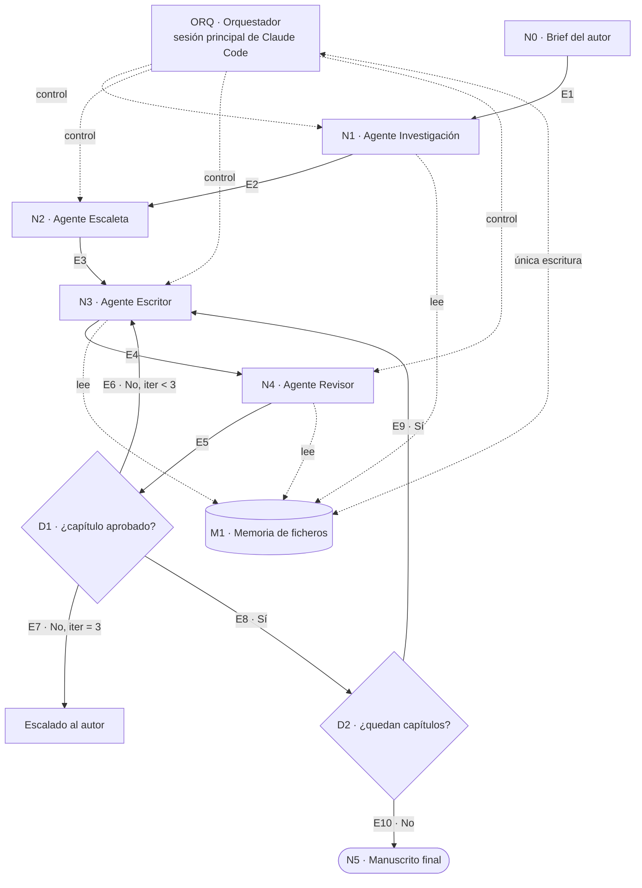

# SPECS · MyStiryMaker

**Versión:** 2.2
**Sistema:** escritura agéntica de una novela sobre un boxeador zurdo en la época actual.
**Implementación:** harness sobre Claude Code.
**Diagrama de referencia:** `docs/diagrama.drawio`

---

## 0. Cómo leer este documento

El diagrama es el contrato. Cada elemento dibujado tiene aquí una sección con identificador, entradas, salidas y condición de salida. Si algo no está en el diagrama, no pertenece a la versión 1.

La implementación no es una aplicación con un bucle propio: es un **harness de Claude Code**. La sesión principal hace de orquestador, cada agente es un subagente definido en `.claude/agents/`, y el estado vive en ficheros del repositorio. Esto significa que el sistema no tiene servidor, no tiene base de datos y su historial de auditoría es el historial de git.

| Documento | Papel |
|---|---|
| **Este (`SPECS.md`)** | Contrato entre diagrama, harness e implementación |
| `specs/especificacion-funcional.md` | Casos de uso y reglas de negocio |
| `specs/especificacion-tecnica.md` | Esquemas de datos y detalle interno |
| `config/capitulos.json` | Número de capítulos y extensión de cada uno (§12) |

Identificadores: `N` nodo, `D` decisión, `M` memoria, `E` arista, `INV` invariante, `RM` regla de modificación.

---

## 1. Diagrama de referencia



---

## 2. El harness de Claude Code

### 2.1 Correspondencia

| Elemento del diagrama | Artefacto de Claude Code |
|---|---|
| ORQ · Orquestador | Sesión principal, gobernada por `CLAUDE.md` y el comando `/novela` |
| N1 Investigación | Subagente `.claude/agents/investigacion.md` |
| N2 Escaleta | Subagente `.claude/agents/escaleta.md` |
| N3 Escritor | Subagente `.claude/agents/escritor.md` |
| N4 Revisor | Subagente `.claude/agents/revisor.md` |
| D1, D2 | Lógica en el prompt del orquestador, verificada por hooks |
| M1 Memoria | Ficheros del repositorio |
| Condiciones de salida | Hooks de validación en `.claude/settings.json` |
| Ejecución por lotes | Modo headless: `claude -p "/novela continuar"` |

Un subagente es un fichero Markdown con frontmatter YAML en `.claude/agents/`; el cuerpo del fichero es su prompt de sistema, y el frontmatter declara nombre, descripción, herramientas permitidas y modelo. Cada subagente corre en su propia ventana de contexto y solo devuelve su resultado a la sesión principal, que es justo el aislamiento que este diseño necesita: el Escritor no debe ver el razonamiento del Revisor, solo sus notas.

### 2.2 Por qué subagentes y no una sola sesión

El Revisor tiene que juzgar el capítulo sin haberlo escrito. Si el mismo contexto redacta y evalúa, la evaluación se contamina: el modelo defiende su propio texto. Separar en subagentes con contexto limpio es lo que hace que la puntuación de D1 signifique algo.

### 2.3 Estructura del repositorio

```
.
├── CLAUDE.md                    · constitución del proyecto
├── SPECS.md                     · este documento
├── brief.md
├── config/
│   ├── capitulos.json           · §12 — editable por el autor
│   └── capitulos.schema.json
├── .claude/
│   ├── settings.json            · hooks de validación
│   ├── agents/
│   │   ├── investigacion.md
│   │   ├── escaleta.md
│   │   ├── escritor.md
│   │   └── revisor.md
│   └── skills/
│       └── novela/SKILL.md      · comando /novela
├── scripts/
│   ├── validar_capitulos.py     · valida config contra el esquema
│   ├── validar_extension.py     · hook de extensión por capítulo
│   └── consolidar.py            · escritura atómica en memoria
├── memory/{bible,ledger,outline}.json
├── research/  manuscript/  reviews/  logs/  dist/
└── specs/
```

### 2.4 Restricciones de herramientas por subagente

| Subagente | Herramientas | Motivo |
|---|---|---|
| investigacion | Read, Grep, Glob, WebSearch, WebFetch, Write (solo `research/`) | Necesita buscar; no toca memoria |
| escaleta | Read, Grep, Glob | Devuelve objetos; el orquestador escribe |
| escritor | Read, Grep, Glob | Devuelve el texto; el orquestador escribe |
| revisor | Read, Grep, Glob | Solo lectura por diseño (INV-09) |

### 2.5 Hooks como guardianes de las condiciones de salida

Las condiciones de salida de §4 a §8 no son recomendaciones en un prompt: son comprobaciones ejecutables.

| Hook | Momento | Comprueba |
|---|---|---|
| `validar_capitulos.py` | Al editar `config/capitulos.json` | Esquema, numeración, unidad y suma de extensión |
| `validar_extension.py` | Al escribir en `manuscript/` | Recuento de líneas no vacías frente a `lineas_objetivo` y reparto en párrafos (N3) |
| `bloquear_memoria.py` | Antes de escribir en `memory/` | Que el emisor sea el orquestador (INV-09) |
| `registrar_coste.py` | Al terminar cada subagente | Traza en `logs/run-*.jsonl` |

Regla de diseño: bloquear al final del paso, no a mitad de la edición. Un hook que interrumpe al agente mientras escribe produce peores resultados que dejarle terminar y rechazar después.

### 2.6 Modos de ejecución

| Comando | Uso |
|---|---|
| `/novela estado` | Muestra progreso según `outline.json` |
| `/novela capitulo N` | Ejecuta el ciclo de un capítulo |
| `/novela continuar` | Ejecuta hasta agotar pendientes o escalar |
| `claude -p "/novela continuar"` | Ejecución headless, para lotes largos o CI |
| `python scripts/compilar.py` | Produce la novela entera sin sesión interactiva y cierra N5 |

La última fila es el **lanzador**: `scripts/pipeline.py` abre una sesión headless por paso —N1 y N2 primero, luego el ciclo de cada capítulo— y `compilar.py` compila cuando no queda pendiente. El lanzador no orquesta: no puntúa, no escribe prosa y no toca `memory/`. Decide qué paso falta, lo lanza y comprueba el estado al volver; D1, el máximo de iteraciones y el orden estricto siguen donde estaban. Cada paso comprueba antes si su trabajo ya está hecho, así que una ejecución interrumpida continúa donde se quedó.

Es una comodidad de operación, no un cambio de arquitectura: el orquestador sigue siendo la sesión de Claude Code, solo que quien la abre es un script en lugar de una persona.

---

## 3. N0 · Brief del autor

**Tipo:** entrada humana.
**OUT:** `brief.md`
**Condición de salida:** los seis campos obligatorios completos — premisa, tono, persona y tiempo narrativos, extensión objetivo, arco deseado, vetos. El sistema no inventa valores por defecto.

---

## 4. N1 · Agente Investigación

**IN:** `brief.md` + lista fija de temas obligatorios.
**OUT:** `research/*.md` con fuentes.
**Condición de salida:** los seis temas cubiertos y cada afirmación factual con fuente o marcada como licencia narrativa.

**Temas obligatorios:** técnica del zurdo frente al ortodoxo; categorías y reglamento vigente; circuito profesional actual (bolsas, promotoras, retransmisión); pesaje y corte de peso; lesiones, cut man y efectos a largo plazo; contexto contemporáneo (redes, patrocinios, presión mediática).

---

## 5. N2 · Agente Escaleta

**IN:** `brief.md` + `research/*.md` + `config/capitulos.json`.
**OUT:** `bible.json` + `outline.json`.
**Condición de salida:** el plan respeta exactamente el número de capítulos y las extensiones de `config/capitulos.json`; existe muestra de voz en la biblia; cada combate declara un problema táctico distinto; el autor aprueba de forma explícita.

**Restricción clave:** N2 no decide cuántos capítulos hay. Eso lo fija el autor en `config/capitulos.json` (§12). N2 rellena objetivo, punto de vista, conflicto y salida de cada uno.

---

## 6. N3 · Agente Escritor

**IN:** `outline.json[N]` + `bible.json` + resúmenes de capítulos anteriores + notas de revisión si es reescritura.
**OUT:** `manuscript/cap-NN.md` + hechos duros declarados.
**Condición de salida:** extensión exactamente igual a `lineas_objetivo` (la tolerancia vigente es cero) y, si el capítulo declara estructura, reparto exacto en `parrafos_objetivo` párrafos de `lineas_por_parrafo` líneas; campo de hechos declarados presente aunque esté vacío; sin marcadores de trabajo.

**Restricciones:** no introduce fechas, resultados, lesiones ni cambios de peso sin declararlos; no modifica la escaleta; recibe completos solo los dos capítulos anteriores, el resto como resumen.

---

## 7. N4 · Agente Revisor

**IN:** `cap-NN.md` + `bible.json` + `ledger.json`.
**OUT:** `reviews/cap-NN.json`.
**Condición de salida:** los cinco criterios puntuados y toda nota con ubicación, problema y sugerencia.

**Rúbrica (1–5):** tensión, verosimilitud técnica, avance del arco, calidad de prosa, continuidad.
**Orden obligatorio:** puntuar primero, justificar después.
**En capítulos con combate verifica además:** coherencia de la guardia invertida durante todo el asalto, duelo de pie adelantado, uso del clinch, trabajo de esquina y lectura de tarjetas.

---

## 8. D1 · ¿Capítulo aprobado?

```
aprobado ⟺ continuidad ≥ 3 ∧ min(criterios) ≥ 3 ∧ media ≥ 4,0
```

| Resultado | Arista | Efecto |
|---|---|---|
| Aprobado | E8 | El orquestador consolida en M1 y pasa a D2 |
| Rechazado, iteración < 3 | E6 | Vuelve a N3 con las notas |
| Rechazado, iteración = 3 | E7 | Estado `escalado`; se detiene y se presenta al autor |

Una puntuación de 1 o 2 en continuidad rechaza el capítulo aunque la media sea alta. Es la única asimetría deliberada de la rúbrica.

---

## 9. D2 · ¿Quedan capítulos?

**IN:** `outline.json`.
Si existe algún capítulo `pendiente`, se toma el de menor número y se vuelve a N3 (E9). Si no queda ninguno, se pasa a N5 (E10).

Los capítulos se procesan en orden estricto. No hay paralelización en la versión 1: escribir N+1 antes de consolidar N rompe el ledger.

---

## 10. N5 · Manuscrito final

**IN:** todos los capítulos consolidados.
**OUT:** `dist/manuscrito.md`.
**Condición de salida:** sin hilos abiertos en el ledger, récord coherente con la suma de combates, sin marcadores de trabajo, 12 líneas totales, aprobación explícita del autor.

El manuscrito conserva el reparto en párrafos con el que se escribió cada capítulo.

---

## 11. M1 · Memoria de ficheros

| Fichero | Contenido | Escribe | Leen |
|---|---|---|---|
| `brief.md` | Entrada del autor | Autor | N1, N2 |
| `research/*.md` | Notas y fuentes | N1 | N2, N3, N4 |
| `config/capitulos.json` | Plan de capítulos y extensión | Autor | ORQ, N2, N3 |
| `memory/bible.json` | Personajes, voz, reglas | ORQ | N3, N4 |
| `memory/outline.json` | Escaleta y estado por capítulo | ORQ | ORQ, N3 |
| `memory/ledger.json` | Cronología, récord, lesiones, hilos | ORQ | N4 |
| `manuscript/cap-NN.md` | Capítulos | ORQ | N3, N4 |
| `reviews/cap-NN.json` | Puntuaciones y notas | ORQ | ORQ |
| `logs/run-*.jsonl` | Trazas, tokens y coste | ORQ | Autor |
| `dist/manuscrito.md` | Entregable | ORQ | Autor |

**Reglas de acceso:** solo el orquestador escribe en `memory/`, y solo al consolidar. La escritura es atómica (fichero temporal y renombrado) e incrementa `version`. Un capítulo no entra en memoria hasta superar D1. La recuperación de contexto se limita a capítulos anteriores al actual.

---

## 12. Configuración de capítulos · `config/capitulos.json`

Este fichero es el único sitio donde se decide cuántos capítulos tiene la novela y cuánto mide cada uno. Es editable por el autor en cualquier momento, sujeto a las reglas de §12.3.

**Configuración vigente: 1 capítulo de 3 párrafos de 4 líneas cada uno (12 líneas).** Es una configuración mínima: sirve para recorrer el circuito completo (N1 a N5, el bucle de reescritura y la consolidación en memoria) en minutos y con coste despreciable, antes de lanzar una novela larga. Nada del resto del sistema cambia al ampliarla; solo este fichero.

### 12.1 Fichero

```json
{
  "$schema": "./capitulos.schema.json",
  "version": 3,
  "titulo_trabajo": "El zurdo",
  "extension": {
    "unidad": "lineas",
    "lineas_totales_objetivo": 12,
    "tolerancia_capitulo_lineas": 0,
    "tolerancia_total_lineas": 0
  },
  "defaults": {
    "pov": "prota",
    "lineas_objetivo": 12,
    "parrafos_objetivo": 3,
    "lineas_por_parrafo": 4
  },
  "capitulos": [
    { "n": 1, "acto": 1, "titulo": "Guardia invertida", "lineas_objetivo": 12, "parrafos_objetivo": 3, "lineas_por_parrafo": 4, "contiene_combate": false }
  ]
}
```

**Total planificado:** 12 líneas en 1 capítulo, sin combate, repartidas en 3 párrafos de 4 líneas.

**Definición de línea:** línea no vacía del cuerpo del capítulo, separada por salto de línea, excluyendo el título.

**Definición de párrafo:** bloque de líneas consecutivas separado del siguiente por una línea en blanco. Cuando un capítulo declara `parrafos_objetivo`, no basta con que cuadre el total: el reparto tiene que ser exacto, y `parrafos_objetivo × lineas_por_parrafo` debe coincidir con `lineas_objetivo`. La estructura es opcional; si no se declara, solo se comprueba el total.

**Por qué la tolerancia es cero:** con extensiones de doce líneas, un margen porcentual no significa gran cosa (el 15 % de 12 son 1,8 líneas) y deja de poderse comprobar el reparto en párrafos. La comprobación de N3 es igualdad exacta: doce líneas son doce, en tres bloques de cuatro. Si se vuelve a una extensión larga, hay que restaurar `tolerancia_capitulo_pct` y `tolerancia_total_pct` en lugar de los campos en líneas.

### 12.2 Campos

| Campo | Tipo | Obligatorio | Significado |
|---|---|---|---|
| `version` | entero | sí | Sube en cada edición. Permite detectar cambios a mitad de producción |
| `extension.unidad` | `lineas` \| `palabras` | sí | Unidad en la que se mide la extensión. Determina qué campos son válidos |
| `extension.lineas_totales_objetivo` | entero | sí | Extensión objetivo de la novela, en la unidad declarada |
| `extension.tolerancia_capitulo_lineas` | entero | sí | Margen admitido por capítulo en N3. Cero significa igualdad exacta |
| `extension.tolerancia_total_lineas` | entero | sí | Margen admitido en la suma del plan |
| `defaults.pov` | texto | no | Punto de vista por defecto |
| `defaults.lineas_objetivo` | entero | no | Extensión usada si un capítulo no la declara |
| `capitulos[].n` | entero | sí | Número de capítulo, único y consecutivo desde 1 |
| `capitulos[].acto` | 1 \| 2 \| 3 | sí | Acto al que pertenece |
| `capitulos[].titulo` | texto | no | Título provisional; N2 puede proponer otro |
| `capitulos[].lineas_objetivo` | entero | no | Extensión objetivo; hereda de `defaults` |
| `capitulos[].parrafos_objetivo` | entero | no | Número exacto de párrafos del capítulo; hereda de `defaults` |
| `capitulos[].lineas_por_parrafo` | entero | no | Líneas exactas de cada párrafo; exige `parrafos_objetivo` |
| `capitulos[].contiene_combate` | booleano | sí | Activa la verificación técnica en N4 |

`estado` e `iteraciones` **no** viven aquí: son estado de producción y pertenecen a `outline.json`. Separarlos es lo que permite editar el plan sin pisar el progreso.

### 12.3 Reglas de modificación

| ID | Regla |
|---|---|
| RM-01 | Añadir, eliminar o reordenar capítulos solo afecta a los que están en estado `pendiente` |
| RM-02 | Modificar un capítulo ya consolidado no tiene efecto salvo que se marque explícitamente para reescritura |
| RM-03 | Al guardar, un hook valida contra el esquema: `n` único y consecutivo, actos ordenados, suma dentro de la tolerancia total, coherencia entre `unidad` y los campos de extensión, y que `parrafos_objetivo × lineas_por_parrafo` cuadre con `lineas_objetivo` |
| RM-04 | Si cambia la numeración, el orquestador reindexa `outline.json` y `ledger.json`; los ficheros de `manuscript/` se renombran en el mismo commit |
| RM-05 | Cada edición incrementa `version` y se registra en git con mensaje `config: …` |
| RM-06 | Cambiar `contiene_combate` a `true` en un capítulo consolidado lo devuelve a `pendiente`: la verificación técnica de N4 no se ejecutó |
| RM-07 | Cambiar la extensión objetivo de un capítulo consolidado lo devuelve a `pendiente` si la diferencia excede la tolerancia con la que se escribió. Cambiar su reparto en párrafos lo devuelve a `pendiente` sin más: la forma no se puede reparar sin reescribir |
| RM-08 | Cambiar `extension.unidad` invalida todo el plan: todos los capítulos vuelven a `pendiente` |

### 12.4 Efecto de una edición a mitad de producción

1. El hook valida el fichero y sube `version`.
2. El orquestador compara con `outline.json` y calcula el diff.
3. Los capítulos nuevos se añaden como `pendiente`; los eliminados que ya estaban consolidados se conservan en `manuscript/` pero salen del plan y se avisa al autor.
4. `ledger.json` se revisa: si un capítulo eliminado abría un hilo, el hilo queda huérfano y se marca para resolución manual.
5. Nada se borra sin commit previo.

---

## 13. Invariantes

| ID | Invariante | Quién lo vigila |
|---|---|---|
| INV-01 | Ningún capítulo entra en memoria sin revisión aprobada | D1 |
| INV-02 | Ningún capítulo excede 3 iteraciones | ORQ |
| INV-03 | La escaleta no cambia durante la producción sin intervención humana | RM-01 a RM-07 |
| INV-04 | El récord solo cambia en capítulos con combate oficial | N4 |
| INV-05 | Los capítulos se consolidan en orden estricto | D2 |
| INV-06 | Todo hecho duro del manuscrito existe en el ledger | N4 |
| INV-07 | No aparecen boxeadores reales en activo como personajes | N2, N4 |
| INV-08 | La condición de zurdo tiene consecuencias en la trama, no solo en los combates | N2 |
| INV-09 | Ningún subagente escribe en `memory/` | Hook `bloquear_memoria.py` |
| INV-10 | El número de capítulos y la extensión del manuscrito coinciden con `config/capitulos.json` | N5 |

---

## 14. Trazabilidad

| Diagrama | Caso de uso | Artefacto de Claude Code |
|---|---|---|
| ORQ | — | `CLAUDE.md` + `.claude/skills/novela/SKILL.md` |
| N0 | CU-01 | `brief.md` |
| N1 | CU-02 | `.claude/agents/investigacion.md` |
| N2 | CU-03 | `.claude/agents/escaleta.md` |
| N3 | CU-04, CU-06 | `.claude/agents/escritor.md` |
| N4 | CU-05 | `.claude/agents/revisor.md` |
| D1 | RN-01 a RN-03, CU-07 | Lógica del orquestador |
| D2 | CU-08 | Lógica del orquestador |
| N5 | CU-08 | `scripts/compilar.py` |
| Lanzador | — | `scripts/pipeline.py` |
| M1 | RN-04, RN-06, RN-07 | `memory/`, hooks de `.claude/settings.json` |
| §12 | RN-09 | `config/capitulos.json` + `validar_capitulos.py` |

---

## 15. Procedimiento de cambio

El diagrama y este documento se modifican en el mismo commit. Un cambio válido incluye: actualizar `docs/diagrama.drawio`, actualizar la sección del nodo o arista afectados, revisar si algún invariante de §13 queda sin vigilante, y actualizar §14.

Un nodo sin condición de salida verificable no se implementa. Si la condición no se puede comprobar con un script, no es una condición: es un deseo.

---

## 16. Deuda aceptada

| Decisión | Coste | Por qué se acepta |
|---|---|---|
| Un solo revisor | Señal de calidad menos fiable que un panel | Se revisará si las iteraciones medias bajan de 1,2 |
| Sin paralelización | Producción más lenta | Protege el ledger, que es el activo central |
| Estado en ficheros | Sin concurrencia | Un solo autor; git sirve de auditoría |
| Orquestador como prompt, no como código | Menos determinista que una máquina de estados | Los hooks cubren lo crítico; se migra a script si D1 empieza a fallar |

---

## 17. Referencias

- Subagentes de Claude Code: https://code.claude.com/docs/en/sub-agents
- Hooks: https://docs.claude.com/en/docs/claude-code/hooks
- Modo headless: https://docs.claude.com/en/docs/claude-code/overview

Las rutas y el formato del frontmatter deben verificarse contra la documentación vigente antes de implementar: Claude Code cambia con frecuencia.
