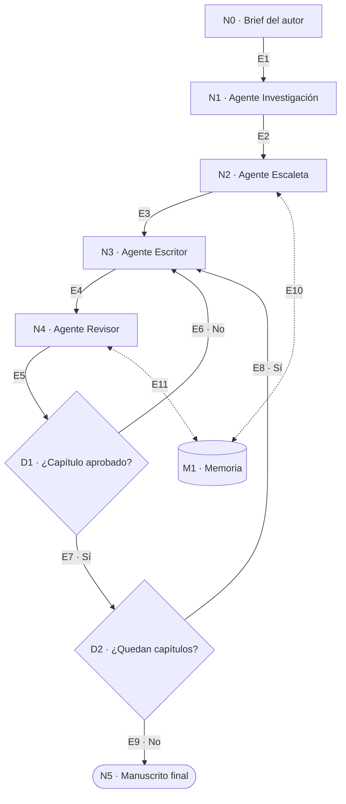

# SPECS · MyStiryMaker

**Versión:** 1.0
**Sistema:** escritura agéntica de una novela sobre un boxeador zurdo en la época actual.
**Diagrama de referencia:** `docs/diagrama.drawio`

---

## 0. Cómo leer este documento

El diagrama es el contrato. Este documento recorre el diagrama nodo por nodo y arista por arista: cada elemento dibujado tiene aquí una sección con identificador, entradas, salidas y condiciones. Si un elemento no aparece en el diagrama, no pertenece a la versión 1 del sistema.

| Documento | Papel |
|---|---|
| **Este (`SPECS.md`)** | Contrato entre el diagrama y la implementación. Fuente de los identificadores |
| `specs/especificacion-funcional.md` | Detalle de comportamiento, casos de uso y reglas de negocio |
| `specs/especificacion-tecnica.md` | Detalle de implementación, esquemas y orquestación |

Convención de identificadores: `N` nodo de proceso, `D` decisión, `M` memoria, `E` arista, `INV` invariante.

---

## 1. Diagrama de referencia



---

## 2. Inventario

### 2.1 Nodos

| ID | Elemento | Tipo | Sección |
|---|---|---|---|
| N0 | Brief del autor | Entrada humana | §3 |
| N1 | Agente Investigación | Agente | §4 |
| N2 | Agente Escaleta | Agente | §5 |
| N3 | Agente Escritor | Agente | §6 |
| N4 | Agente Revisor | Agente | §7 |
| D1 | ¿Capítulo aprobado? | Decisión | §8 |
| D2 | ¿Quedan capítulos? | Decisión | §9 |
| N5 | Manuscrito final | Entregable | §10 |
| M1 | Memoria | Almacén | §11 |

### 2.2 Aristas

| ID | Origen → Destino | Condición | Carga |
|---|---|---|---|
| E1 | N0 → N1 | Brief válido | `brief.md` |
| E2 | N1 → N2 | Temas obligatorios cubiertos | `ResearchPack` |
| E3 | N2 → N3 | Escaleta aprobada por el autor | `Bible`, `Outline` |
| E4 | N3 → N4 | Borrador emitido | `ChapterDraft` |
| E5 | N4 → D1 | Rúbrica puntuada | `Review` |
| E6 | D1 → N3 | Veredicto = rechazado e iteraciones < 3 | Notas de revisión |
| E7 | D1 → D2 | Veredicto = aprobado | Capítulo consolidado |
| E8 | D2 → N3 | Existe capítulo con estado `pendiente` | Siguiente `ChapterPlan` |
| E9 | D2 → N5 | Ningún capítulo pendiente | Manuscrito compilable |
| E10 | N2 ↔ M1 | — | Escritura de biblia y escaleta |
| E11 | N4 ↔ M1 | — | Lectura de ledger, escritura de hechos nuevos |

---

## 3. N0 · Brief del autor

**Tipo:** entrada humana. Único nodo que no automatiza nada.

**Salida:** `brief.md`

**Campos obligatorios:** premisa, tono, persona y tiempo narrativos, extensión objetivo, arco deseado, vetos.

**Criterio de aceptación:** el sistema rechaza el arranque si falta un campo y los solicita uno a uno. No inventa valores por defecto para ninguno de los seis.

---

## 4. N1 · Agente Investigación

**Precondición:** E1 satisfecha.

**Entrada:** `brief.md` + lista fija de temas obligatorios.

**Temas obligatorios:**
1. Técnica del zurdo frente al ortodoxo: guardia invertida, duelo de pie adelantado, jab de derecha, cruzado de izquierda, riesgos del choque de cabezas.
2. Categorías de peso y reglamento vigente.
3. Circuito profesional actual: bolsas, promotoras, retransmisión, apuestas.
4. Pesaje y corte de peso.
5. Lesiones habituales, trabajo del cut man, conmoción y efectos a largo plazo.
6. Contexto contemporáneo: redes sociales, patrocinios, presión mediática.

**Salida:** `research/*.md` + `ResearchPack` con fuentes por afirmación.

**Criterio de aceptación:** ningún tema obligatorio queda sin cubrir, y toda afirmación factual tiene fuente o queda marcada explícitamente como licencia narrativa.

---

## 5. N2 · Agente Escaleta

**Entrada:** `brief.md` + `ResearchPack` (E2).

**Proceso:** define personajes y ambientación, y deriva el plan de capítulos. El protagonista zurdo, el entrenador, el rival ortodoxo como espejo temático y el promotor son obligatorios; el resto es libre.

**Salida:** `memory/bible.json` y `memory/outline.json` (E10).

**Cada capítulo del plan declara:** número, título, objetivo dramático, punto de vista, conflicto, salida, si contiene combate o sparring, palabras objetivo, estado.

**Criterio de aceptación:** la suma de palabras objetivo cae dentro del ±10 % de la extensión del brief; cada combate declara un problema táctico distinto de los anteriores; existe una muestra de voz del narrador en la biblia.

**Punto de control humano:** E3 requiere aprobación explícita del autor. Es el último momento barato para cambiar de rumbo.

---

## 6. N3 · Agente Escritor

**Entrada:** `ChapterPlan` del capítulo N + biblia + resúmenes de capítulos anteriores + notas de revisión si viene por E6.

**Proceso:** redacta el capítulo en prosa. Recibe los dos capítulos anteriores completos y el resto como resumen.

**Salida:** `manuscript/cap-NN.md` + lista de hechos duros declarados.

**Restricciones:**
- No introduce fechas, resultados de combate, lesiones ni cambios de peso sin declararlos.
- No modifica la escaleta.
- No añade marcadores de trabajo ni texto entre corchetes.

**Criterio de aceptación:** extensión dentro del ±15 % del objetivo y campo de hechos declarados presente, aunque esté vacío.

---

## 7. N4 · Agente Revisor

Este nodo concentra cuatro funciones que en la arquitectura extendida eran agentes separados: continuidad, estilo, verosimilitud técnica y crítica global.

**Entrada:** borrador (E4) + biblia + ledger (E11).

**Proceso:** puntúa primero, redacta notas después. El orden importa: si justifica antes de puntuar, la nota arrastra la puntuación.

**Rúbrica (1–5 por criterio):** tensión, verosimilitud técnica, avance del arco, calidad de prosa, continuidad.

**En capítulos con combate verifica además:** coherencia de la guardia invertida durante todo el asalto, duelo de pie adelantado, uso del clinch, trabajo de esquina y lectura de tarjetas.

**Salida:** `reviews/cap-NN.json` con puntuaciones, media, veredicto, notas accionables y hechos nuevos detectados.

**Criterio de aceptación:** toda nota tiene ubicación, problema y sugerencia. Una nota sin ubicación invalida la revisión.

---

## 8. D1 · ¿Capítulo aprobado?

**Función de decisión:**

```
aprobado  ⟺  continuidad ≥ 3
              ∧ min(todos los criterios) ≥ 3
              ∧ media ≥ 4,0
```

| Resultado | Arista | Efecto |
|---|---|---|
| Aprobado | E7 | Consolidar en M1 y pasar a D2 |
| Rechazado, iteraciones < 3 | E6 | Devolver a N3 con las notas |
| Rechazado, iteraciones = 3 | — | Estado `escalado`; detener y presentar al autor |

**Nota:** una puntuación de 1 o 2 en continuidad rechaza el capítulo aunque la media sea alta. Es la única asimetría deliberada de la rúbrica.

---

## 9. D2 · ¿Quedan capítulos?

**Entrada:** `memory/outline.json`.

| Resultado | Arista | Efecto |
|---|---|---|
| Existe capítulo `pendiente` | E8 | Seleccionar el de menor número y volver a N3 |
| Ninguno pendiente | E9 | Pasar a N5 |

**Restricción:** los capítulos se procesan en orden estricto. No hay paralelización en la versión 1, porque escribir N+1 antes de consolidar N rompe el ledger.

---

## 10. N5 · Manuscrito final

**Entrada:** todos los capítulos consolidados (E9).

**Salida:** `dist/manuscrito.md`.

**Criterios de aceptación:**
1. Todos los capítulos de la escaleta están consolidados.
2. No hay marcadores de trabajo, notas de agente ni texto entre corchetes.
3. Todos los hilos abiertos del ledger están cerrados.
4. El récord del protagonista al cierre coincide con la suma de combates registrados.
5. Existe aprobación explícita del autor.

---

## 11. M1 · Memoria

Almacén compartido. Lo escribe únicamente el orquestador, y solo al consolidar un capítulo.

| Componente | Fichero | Qué guarda | Quién lo lee |
|---|---|---|---|
| Biblia | `memory/bible.json` | Personajes, voz, temas, reglas del mundo | N3, N4 |
| Ledger | `memory/ledger.json` | Cronología, récord, lesiones, peso, hilos abiertos | N4 |
| Escaleta viva | `memory/outline.json` | Estado e iteraciones por capítulo | D2, orquestador |
| Capítulos indexados | vector store | Fragmentos de capítulos consolidados | N3, N4 |

**Reglas:**
- La recuperación se limita a capítulos anteriores al actual, para que no se filtre información futura.
- Cada escritura es atómica e incrementa el número de versión.
- Reconsolidar un capítulo no duplica entradas en el ledger.

---

## 12. Invariantes del sistema

| ID | Invariante | Nodo que lo vigila |
|---|---|---|
| INV-01 | Ningún capítulo entra en M1 sin una revisión aprobada | D1 |
| INV-02 | Ningún capítulo excede 3 iteraciones | D1 |
| INV-03 | La escaleta no cambia durante la producción sin intervención humana | N2, D2 |
| INV-04 | El récord del protagonista solo cambia en capítulos con combate oficial | N4 |
| INV-05 | Los capítulos se consolidan en orden estricto | D2 |
| INV-06 | Todo hecho duro del manuscrito existe en el ledger | N4 |
| INV-07 | No aparecen boxeadores reales en activo como personajes | N2, N4 |
| INV-08 | La condición de zurdo tiene consecuencias en la trama, no solo en los combates | N2 |

---

## 13. Trazabilidad

| Elemento del diagrama | Caso de uso funcional | Componente técnico |
|---|---|---|
| N0 | CU-01 | `cli.py init` |
| N1 | CU-02 | `agents/research.py` |
| N2 | CU-03 | `agents/outline.py` |
| N3 | CU-04, CU-06 | `agents/writer.py` |
| N4 | CU-05 | `agents/reviewer.py` |
| D1 | RN-01, RN-02, RN-03, CU-07 | `orchestrator.aprobado()` |
| D2 | CU-08 | `orchestrator` estado `GATE_REMAINING` |
| N5 | CU-08 | `cli.py compile` |
| M1 | RN-04, RN-06, RN-07 | `memory/store.py`, `memory/vectors.py` |

---

## 14. Procedimiento de cambio

El diagrama y este documento se modifican en el mismo commit. Un cambio válido incluye:

1. Actualizar `docs/diagrama.drawio`.
2. Actualizar el inventario (§2) y la sección del nodo o arista afectados.
3. Revisar si algún invariante de §12 deja de estar vigilado.
4. Actualizar la tabla de trazabilidad (§13).

Si un cambio añade un nodo, necesita sección propia con entradas, salidas y criterio de aceptación antes de implementarse. Un nodo sin criterio de aceptación no se implementa.

---

## 15. Deuda aceptada en la versión 1

| Decisión | Coste | Por qué se acepta |
|---|---|---|
| Un solo revisor en lugar de un panel | Señal de calidad menos fiable | El panel multiplica el coste; se revisará si las iteraciones medias bajan de 1,2 |
| Sin paralelización de capítulos | Producción más lenta | Protege el ledger, que es el activo central del sistema |
| Persistencia en ficheros | Sin concurrencia | Un solo autor; el historial de git sirve de auditoría |
| N4 concentra cuatro funciones | Notas menos especializadas | Mantiene el diagrama legible; se puede dividir sin tocar las aristas |
