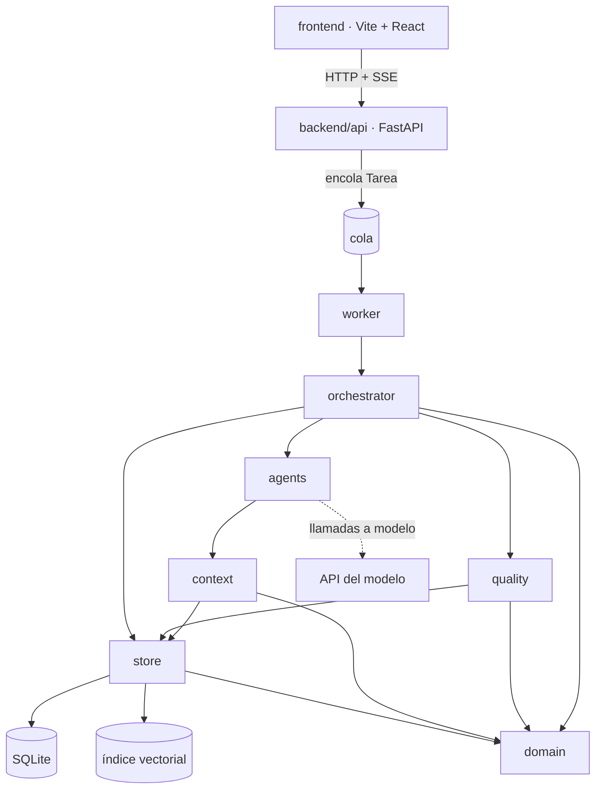
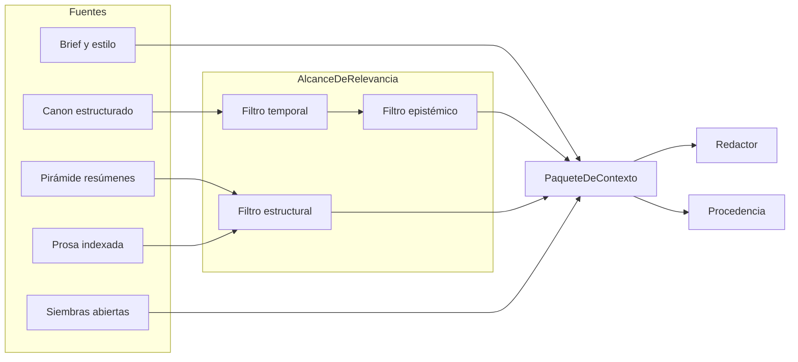
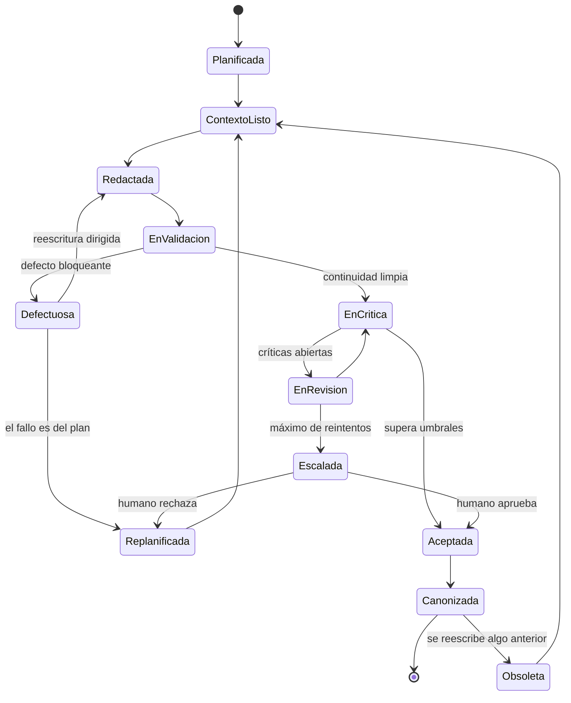

# Arquitectura

Cómo está construido el sistema: stack, módulos, almacenamiento, tuberías de contexto y
calidad, y orden de adopción.

**Qué no está aquí.** Las definiciones de las clases del dominio están en
`definitions.md`. El conocimiento narrativo — por qué una escena necesita un cambio de
valor, qué hace que una siembra funcione, cómo se construye la ironía dramática — está
en `domain-knowledge.md`. Este documento solo habla de máquinas.

La regla para decidir dónde va algo nuevo: si sigue siendo verdad cambiando de stack, no
es arquitectura. Si sigue siendo verdad cambiando de género literario, no es dominio.

---

## 1. Decisiones técnicas

Stack fijado. Un cambio en esta tabla requiere un `RegistroDeDecision`.

| Capa | Decisión |
| --- | --- |
| Backend | FastAPI (Python) |
| Frontend | React |
| Persistencia | SQLite |
| Límite de contexto del modelo | 100.000 tokens |

Tres decisiones transversales que no son de stack pero condicionan todo lo demás:

1. **El canon es estructura, no prosa.** La fuente de verdad es un grafo consultable. La
   prosa es salida, y vive en una sola tabla.
2. **Quien genera no valida.** La separación de permisos de escritura por rol está en
   `AGENTS.md` y se aplica en el orquestador, no por convención.
3. **Solo lo determinista bloquea.** Los verificadores programáticos pueden parar la
   línea; los jueces basados en modelo solo penalizan.

---

## 2. Módulos y límites

```
backend/
  domain/        Clases de la ontología. Sin dependencias de infraestructura.
    diegetic/    Entidad, EventoNarrativo, Hecho, EstadoDeConocimiento, ReglaDelMundo
    discursive/  Escena, Capitulo, Hilo, ParSiembraPago, PerfilDeEstilo, Motivo
    production/  Tarea, Borrador, Critica, Puerta, Procedencia
    spec/        Brief, Restriccion, ContratoDeEstilo
  context/       Pirámide de resúmenes, AlcanceDeRelevancia, ensamblado de paquetes
  quality/       Verificadores programáticos, rúbricas, jueces, umbrales
  agents/        Un módulo por rol. Prompts versionados.
  store/         SQLite + índice vectorial. Único acceso a datos.
  orchestrator/  Planificación, asignación, puertas, reintentos
  api/           FastAPI: rutas, esquemas Pydantic, SSE. Sin lógica de dominio.
  worker/        Consumidor de la cola de Tarea. Aquí viven las llamadas a modelos.
  migrations/    Esquema de SQLite, versionado y hacia delante.
frontend/        Vite + React. Editor de canon, lector de borradores, panel de defectos.
docs/            definitions.md, domain-knowledge.md, architecture.md, verification.md.
specs/           Una spec por cambio: qué se cambia y por qué.
```

Reglas de dependencia:

- `domain/` no importa de ningún otro paquete. Ni del store, ni de agents, ni de FastAPI
  ni Pydantic.
- `quality/` importa de `domain/`, nunca de `agents/`.
- `agents/` no importa de `agents/`. La coordinación entre roles vive en `orchestrator/`.
- Solo `store/` habla con SQLite y con el índice vectorial.
- `api/` no invoca modelos. Encola tareas y lee estado.
- `frontend/` no contiene reglas de dominio. Ninguna, y nunca lee ficheros del sistema:
  todo lo que muestra lo pide al `backend/`.



`domain/` es hoja en este grafo: todo depende de él y él de nada.

---

## 3. Almacenamiento

### 3.1 El grafo sobre SQLite

No hay base de datos de grafos. El grafo del dominio se modela relacionalmente y las
consultas transitivas se hacen con CTEs recursivas:

- Grafo causal de `EventoNarrativo`: detección de ciclos y precedencia.
- Cierre de `deriva_de` en `UnidadDeContexto`: invalidación en cascada.
- Jerarquía espacial de `Lugar` (`contiene` / `contenido_en`).

Consecuencias operativas:

- **WAL activo** (`journal_mode=WAL`) y `foreign_keys=ON` en cada conexión.
- **Un solo escritor.** SQLite serializa escrituras; el orquestador es el único punto que
  las emite. Ningún agente escribe en paralelo sobre la misma revisión del canon.
- **Índices explícitos** sobre `(sujeto_id, predicado)` en `HECHO`, sobre
  `posicion_en_historia` en `EVENTO` y sobre `(conocedor_id, hecho_id)` en
  `ESTADO_CONOCIMIENTO`. Las validaciones de intervalos y de fugas epistémicas son las
  consultas más frecuentes del sistema.
- **El canon versionado no se copia entero** por revisión. Se guardan eventos de cambio y
  se reconstruye; una copia por revisión no escala a 40 capítulos.

SQLite es razonable aquí porque el volumen es pequeño — decenas de miles de filas — y el
patrón es un solo autor. El momento de revisar la decisión es cuando haya varias novelas
concurrentes en el mismo proceso, no antes.

### 3.2 Grafo vs. vectorial

| Almacén | Contenido | Uso |
| --- | --- | --- |
| Grafo (SQLite) | Hechos, eventos, estados, relaciones | Fuente de verdad. Validación. |
| Vectorial | Prosa indexada | Recuperación por similitud |

El índice vectorial sirve para encontrar cómo se describió antes un lugar, recuperar
escenas de tono análogo y detectar que una imagen ya se usó. Implementación: extensión
`sqlite-vec` en el mismo fichero, o un fichero aparte. Solo `store/` conoce la
diferencia.

**Nunca se valida un hecho contra el índice vectorial.** La similitud semántica no
distingue entre lo que ocurrió y lo que casi ocurrió.

### 3.3 Extracción de hechos

La canonización desde prosa aceptada es el punto más frágil de la tubería. El redactor
emite un bloque estructurado de `hechos_nuevos_detectados` junto con la prosa, en lugar
de que otro modelo los extraiga después: declarar es más fiable que inferir.

El canonizador normaliza, comprueba contra el canon y promueve. Lo que contradice el
canon genera un `Defecto`; nunca lo sobrescribe.

---

## 4. Tubería de contexto

### 4.1 Presupuesto

El límite de 100.000 tokens es un techo, no un objetivo. El `PaqueteDeContexto` de una
escena apunta a **20.000–25.000 tokens**.

| Componente | Tokens |
| --- | --- |
| Estático (premisa, contrato de estilo, políticas) | 2.000 |
| Estado del mundo (hechos vigentes filtrados) | 6.000 |
| Prosa literal de la escena anterior | 3.500 |
| Pirámide de resúmenes (parte, capítulo, escenas) | 4.000 |
| Voz (perfil global + idiolectos presentes) | 1.500 |
| Epistémico (lo que el POV sabe e ignora) | 2.000 |
| Promesas (siembras abiertas, motivos pendientes) | 1.000 |
| Instrucción (esqueleto de escena) | 1.000 |
| Margen de seguridad | 3.000 |
| **Total entrada** | **24.000** |
| Salida esperada | 3.000–4.000 |

Reglas:

- El ensamblador **cuenta tokens antes de llamar** y rechaza el paquete si excede su
  presupuesto. Nunca se trunca por la cola: eso borra el final de la instrucción.
- Si un paquete no cabe, **se aprietan los filtros**, no se sube el presupuesto. Subirlo
  esconde el síntoma de que la pirámide de resúmenes no funciona.
- El margen de 75.000 tokens libres es para tareas de nivel superior: revisión de
  capítulo completo, n-gramas contra varios capítulos, juicio de acto. No es espacio
  disponible para redactar una escena.
- `PaqueteDeContexto` almacena el recuento real por componente. Es la métrica que dice si
  la compresión se degrada a lo largo del libro.

**Invariante operativo:** el paquete de la escena 3 y el de la escena 40 tienen
aproximadamente el mismo tamaño. Si crece con la longitud del libro, es un bug.

### 4.2 Ensamblado



El orden importa: el filtro temporal actúa antes del epistémico. Primero se determina qué
es verdad en ese momento, y solo después qué de eso conoce el POV.

### 4.3 Invalidación en cascada

Al reescribir una escena se marcan obsoletos, siguiendo las aristas `deriva_de`:

1. Los resúmenes de esa escena.
2. Los resúmenes de todo contenedor que la incluye.
3. Los hechos que establecía.
4. Los paquetes de contexto que la citaban.

Sin dependencias explícitas el sistema acumula canon fantasma: hechos que ya nadie narra
pero que siguen condicionando las escenas siguientes. Es el fallo más insidioso, porque
el sistema sigue pareciendo coherente consigo mismo mientras se separa del texto real.

---

## 5. Tubería de calidad

### 5.1 Reparto de autoridad

| Vía | Puede bloquear | Cuándo corre |
| --- | --- | --- |
| Programática | Sí | En cada borrador |
| Juez basado en modelo | Solo penaliza | En cada borrador |
| Humano | Sí, con excepción autorizada | Muestreo y puertas de cierre |

Un juez basado en modelo con autoridad de bloqueo produce bucles caros e inestables,
porque su puntuación varía entre llamadas sobre el mismo texto. Un verificador
programático es determinista y por eso puede parar la línea.

Qué se verifica en cada vía está en `definitions.md`; aquí solo importa quién tiene
autoridad.

### 5.2 Puertas

| Puerta | Cuándo | Política |
| --- | --- | --- |
| Outline aprobado | Antes de redactar | Bloqueante |
| Escena limpia | Antes de aceptar un borrador | Bloqueante |
| Capítulo cerrado | Fin de capítulo | Bloqueante |
| Acto cerrado | Fin de acto | Advertencia |
| Volumen cerrado | Final | Bloqueante |

Los invariantes de cada puerta viven como tests en `backend/quality/`. Un invariante sin test
no existe.

### 5.3 Ciclo de vida de una escena



### 5.4 Reintentos y escalado

```
intento 1  → reescritura con los defectos como instrucción
intento 2  → reescritura con contexto ampliado
intento 3  → replanificación de la escena
intento 4  → escalado a humano
```

Si dos intentos consecutivos producen el mismo tipo de defecto, se salta directamente a
replanificación. Repetir la misma operación esperando un resultado distinto es el modo de
fallo más caro de estos sistemas.

---

## 6. API y asincronía

Generar un capítulo tarda minutos. Nada de request/response para generación:

- Los endpoints de generación crean una `Tarea` y devuelven su id con `202 Accepted`.
- El progreso se transmite por SSE en `/tareas/{id}/eventos`. WebSocket solo si hace
  falta bidireccionalidad real.
- Un worker consume la cola. El proceso web no invoca modelos.
- Los modelos Pydantic son la frontera de serialización, no las clases del dominio.

El frontend sirve tres vistas y ninguna lleva lógica de dominio: editor de canon, lector
de borradores con diff entre versiones, y panel de defectos, juicios y estado de puertas.
Toda validación ocurre en el backend; duplicar un invariante en JavaScript garantiza que
las dos copias divergirán.

---

## 7. Reproducibilidad

- El canon es inmutable y se versiona por revisiones. Los borradores son mutables.
- Un `PaqueteDeContexto` referencia la revisión del canon con la que se construyó, lo que
  permite reproducir exactamente una generación pasada.
- Cada llamada registra `Procedencia`: agente, modelo, versión de prompt, hash del
  paquete, parámetros de muestreo, coste y latencia.
- Los prompts son versionados semánticamente. Editar uno sin incrementar la versión rompe
  la reproducibilidad de todo lo generado antes.

El enlace al paquete de contexto responde a la única pregunta que importa al depurar: ¿el
agente se equivocó, o nunca recibió el dato?

---

## 8. Orden de adopción

| Fase | Qué se construye | Qué habilita |
| --- | --- | --- |
| 1 | Las 12 clases del núcleo, contradicción de hechos, siembras abiertas | Detecta el 60% de los fallos típicos |
| 2 | `EstadoDeConocimiento` y `Narracion` | Validación epistémica y de POV |
| 3 | Pirámide de resúmenes y `PaqueteDeContexto` con procedencia | Escalabilidad y depuración |
| 4 | `Rubrica`, `Juicio`, `Puerta` | Calidad medible, proceso controlable |
| 5 | `Motivo`, `Tema`, `PlantillaEstructural`, `RegistroDeDecision` | Techo de calidad literaria |

El error más común es empezar por la fase 5 porque es la más interesante de modelar. Sin
las fases 1 y 2, el sistema produce texto temáticamente rico y factualmente incoherente,
que es peor que lo contrario.

---

## 9. Riesgos conocidos

| Riesgo | Señal temprana | Mitigación |
| --- | --- | --- |
| Canon fantasma | Hechos vigentes que ninguna escena narra | Auditoría de `deriva_de` en cada canonización |
| Deriva de compresión | El paquete crece por capítulo | Métrica de tokens por componente en `PaqueteDeContexto` |
| Bucle de revisión | Mismo tipo de defecto en reintentos sucesivos | Contador de intentos y salto a replanificación |
| Extracción de hechos silenciosamente mala | Canon que no cuadra con la prosa | Declaración por el redactor, no inferencia posterior |
| Contención de escritura en SQLite | `database is locked` | Escritor único en el orquestador |
| Enumeraciones que crecen | Valores nuevos sin decisión registrada | Añadir un valor exige `RegistroDeDecision` |

---

## 10. Qué se movió aquí

Este documento se formó extrayendo de `definitions.md` y `domain-knowledge.md` el
material que no era ni definición ni conocimiento narrativo. Para no duplicar, conviene
eliminar de esos ficheros:

**De `definitions.md`:**

- Las notas de implementación: property graph vs. OWL, híbrido grafo/vectorial,
  versionado, extracción de hechos, coste. → §3 y §7 de aquí.
- El núcleo mínimo viable y el orden de adopción. → §8.
- El reparto de autoridad entre verificación programática, juez y humano (la clasificación
  de qué dimensiones existen se queda; quién puede bloquear se va). → §5.1.
- Los detalles operativos de la capa de contexto: presupuestos concretos, orden de
  filtrado, mecánica de la cascada. La definición de `UnidadDeContexto`,
  `PaqueteDeContexto` y `AlcanceDeRelevancia` se queda. → §4.
- La tabla de puertas con su política. La lista de invariantes se queda. → §5.2.

**De `domain-knowledge.md`:**

- Cualquier mención a SQLite, FastAPI, React, tokens, índices o CTEs.
- La máquina de estados del borrador y la política de reintentos: es proceso, no dominio.
- Los permisos de escritura por rol: son una restricción de arquitectura, y su lugar
  canónico es `AGENTS.md`.

**Criterio para lo dudoso.** Un invariante narrativo ("todo hilo se resuelve") es
dominio. Cómo y cuándo se comprueba es arquitectura. La misma frase puede necesitar
partirse en dos.
