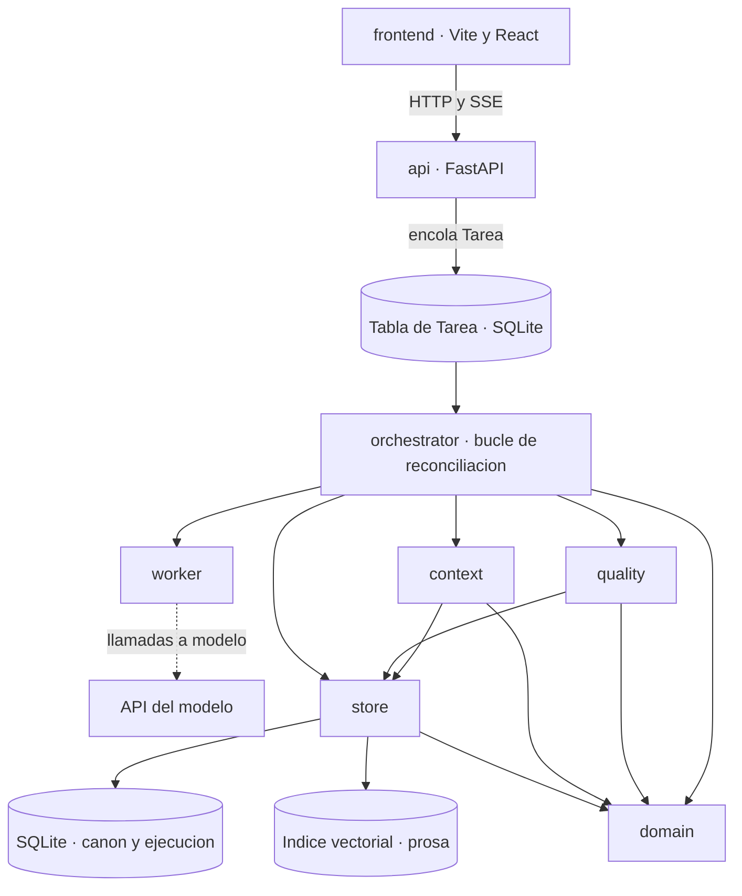
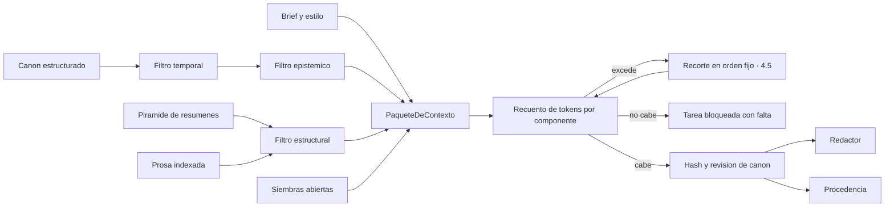
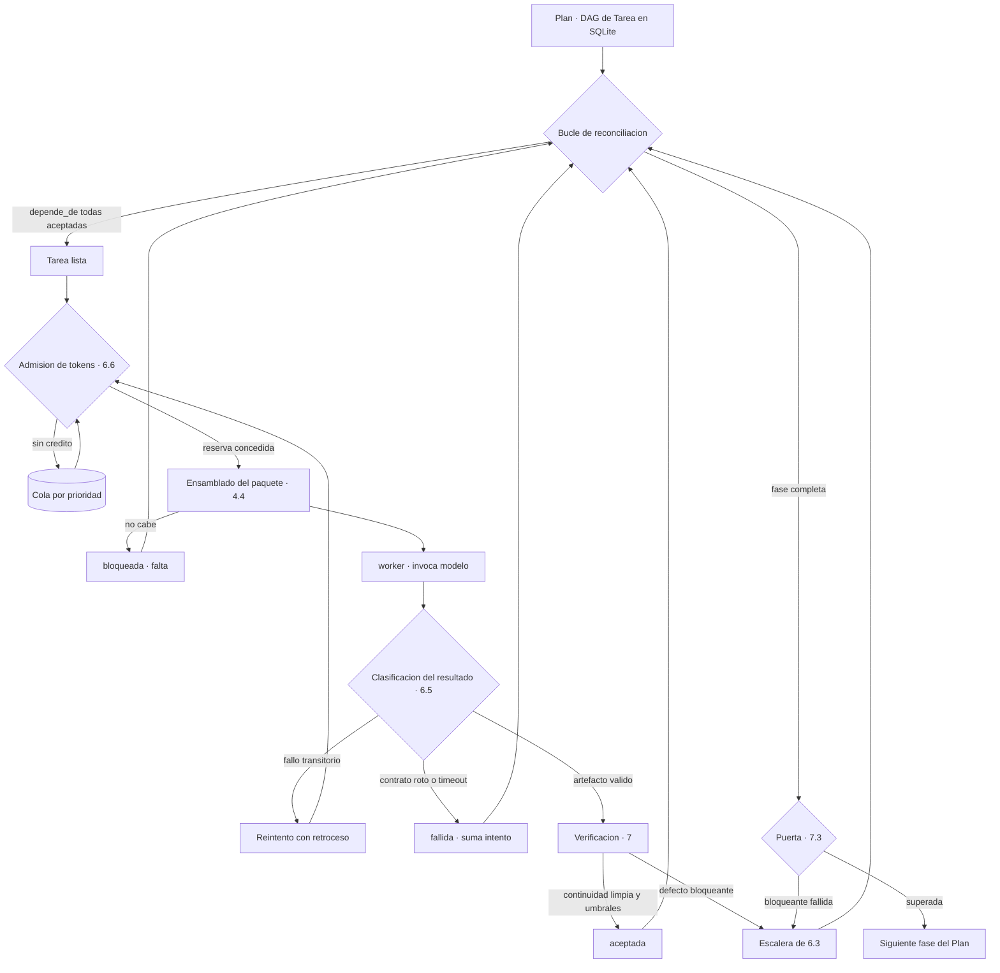
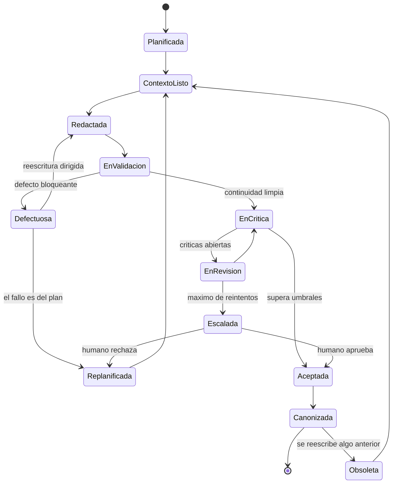
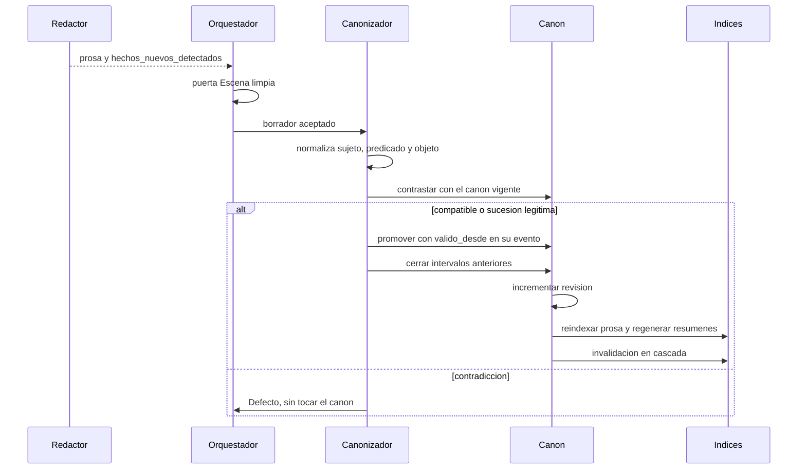

# architecture.md

> Documentación de arquitectura · ver [`../AGENTS.md`](../AGENTS.md) para el contrato de los agentes y [`../CLAUDE.md`](../CLAUDE.md) para convenciones y comandos.
> Relacionados: [definitions](definitions.md) · [domain-knowledge](domain-knowledge.md) · [verification](verification.md)

Cómo está construido el sistema: stack, módulos, memoria, presupuesto de contexto, flujo de
ejecución, calidad y orden de construcción. Este documento solo habla de máquinas.

**Qué no está aquí.** Las definiciones de las clases del dominio están en `definitions.md`.
El conocimiento narrativo está en `domain-knowledge.md`. El contrato de cada rol está en
`AGENTS.md`. La regla para decidir dónde va algo nuevo: si sigue siendo verdad cambiando de
stack, no es arquitectura; si sigue siendo verdad cambiando de género literario, no es
dominio.

Dos restricciones fijan el resto del diseño:

- **El canon es un grafo consultable, no prosa.** La prosa es una proyección y vive en una
  sola tabla. Si la verdad viviera en los capítulos escritos, validar exigiría releerlo todo.
- **100.000 tokens es el techo, en dos planos.** Por llamada, la ventana física. Para el
  sistema, el techo de ocupación simultánea (D-13): la suma de todo lo que está en vuelo en
  el mismo instante.

---

## 1. Principios de diseño

1. **El canon es la fuente de verdad, no el texto.** El canon no almacena prosa; en cuanto la
   admite, deja de ser consultable y vuelve a ser un documento que alguien debe leer entero.
2. **Nada es atemporal.** Todo `Hecho` vale en un intervalo delimitado por `EventoNarrativo`,
   nunca por fechas. Los atributos estáticos son el origen de la deriva de canon.
3. **Quien genera no valida.** La separación de permisos de escritura por rol de `AGENTS.md`
   §2 se aplica en el orquestador, no por convención.
4. **Solo lo determinista bloquea.** Los verificadores programáticos pueden parar la línea;
   los jueces basados en modelo solo penalizan.
5. **El contexto se presupuesta, no se acumula.** Cada llamada recibe un paquete construido a
   propósito. Tener 100.000 tokens no es motivo para usarlos.
6. **El estado de ejecución vive en SQLite, no en el proceso.** Copiar el fichero es copiar el
   estado, y de ahí salen la reanudación y la reproducibilidad.
7. **Una sola autoridad sobre la máquina de estados.** Todas las transiciones las escribe el
   Orquestador; el worker informa y no decide (D-02).
8. **La ausencia de evidencia nunca se convierte en evidencia favorable.** Un juicio que no
   llegó es un hueco declarado, no un aprobado.
9. **Bajo presión el sistema va más lento, no peor.** No hay degradación silenciosa de modelo,
   de prompt ni de paquete (D-08).
10. **Todo artefacto lleva procedencia.** Sin saber qué contexto exacto recibió un agente, un
    fallo de coherencia no es depurable.

---

## 2. Vista de contexto del sistema



`domain/` es hoja en este grafo: todo depende de él y él de nada.

### 2.1 Stack

Un cambio en esta tabla requiere un `RegistroDeDecision`.

| Capa | Decisión | Por qué aguanta hoy |
|---|---|---|
| Backend | FastAPI (Python) | La generación tarda minutos; hace falta asincronía y SSE, no request/response |
| Frontend | React (Vite) | Tres vistas de lectura; ninguna lleva lógica de dominio |
| Persistencia | SQLite | Decenas de miles de filas y un solo autor por proceso (S-1) |
| Ventana del modelo | 100.000 tokens | Techo, no objetivo. Se interpreta como ocupación simultánea (D-13) |

**El frontend no decide nada.** Sirve el editor de canon, el lector de borradores con diff
entre versiones y el panel de defectos, juicios y estado de puertas. Toda validación ocurre en
el backend: duplicar un invariante en JavaScript garantiza que las dos copias divergirán.

### 2.2 Frontera entre las dos mitades

| Qué cruza | Dirección | Forma |
|---|---|---|
| Alta de canon y esqueletos de escena | frontend → backend | Escrituras estructuradas, validadas en el backend |
| Petición de generación | frontend → backend | Crea una `Tarea` y devuelve `202 Accepted` con su id |
| Progreso | backend → frontend | SSE en `/tareas/{id}/eventos`. El frontend no hace *polling* ni infiere progreso |
| Borradores, defectos y puertas | backend → frontend | Lectura |

**Ejecución mixta** (D-05): la cadena redacción → continuidad → crítica → juicio →
canonización de una misma escena es estrictamente secuencial, porque cada paso consume la
salida del anterior. Las escenas independientes del DAG corren en paralelo, con el grado que
permita el crédito de tokens de §6.6. Desde fuera todo es asíncrono. Los modelos Pydantic son
la frontera de serialización, nunca las clases del dominio.

### 2.3 Organización interna: paquete por capa

```
backend/
├── domain/        · clases de la ontología, sin dependencias de infraestructura
│   ├── diegetic/      Entidad, EventoNarrativo, Hecho, EstadoDeConocimiento, ReglaDelMundo
│   ├── discursive/    Escena, Capitulo, Hilo, ParSiembraPago, PerfilDeEstilo, Motivo
│   ├── production/    Tarea, Borrador, Critica, Puerta, Procedencia
│   └── spec/          Brief, Restriccion, ContratoDeEstilo
├── context/       · pirámide de resúmenes, AlcanceDeRelevancia, ensamblado de paquetes
├── quality/       · verificadores programáticos, rúbricas, jueces, umbrales
├── agents/        · un módulo por rol, con prompts versionados
├── store/         · SQLite e índice vectorial. Único acceso a datos
├── orchestrator/  · planificación, asignación, puertas, reintentos
├── api/           · rutas, esquemas Pydantic, SSE. Sin lógica de dominio
├── worker/        · consumidor de la cola de Tarea. Aquí viven las llamadas a modelos
└── migrations/    · esquema de SQLite, versionado y hacia delante
frontend/          · editor de canon, lector de borradores, panel de defectos
```

**Por capa y no por funcionalidad**, al revés que en la mayoría de sistemas de este tipo. El
motivo es que aquí la frontera que hay que hacer cumplir no es funcional sino de autoridad:
quién puede escribir canon, quién puede invocar modelos y quién puede bloquear una puerta. Esa
frontera cruza todas las funcionalidades y se comprueba estáticamente sobre estas seis reglas:

1. `domain/` no importa de ningún otro paquete. Ni del store, ni de agents, ni de FastAPI ni
   Pydantic.
2. `quality/` importa de `domain/`, nunca de `agents/`.
3. `agents/` no importa de `agents/`. La coordinación entre roles vive en `orchestrator/`.
4. Solo `store/` habla con SQLite y con el índice vectorial.
5. `api/` no invoca modelos. Encola tareas y lee estado.
6. `frontend/` no contiene reglas de dominio, y nunca lee ficheros del sistema: todo lo que
   muestra lo pide al backend.

Las seis son un patrón de análisis estático en la puerta de CI, no una convención
(`verification.md` §8). Una regla de dependencia que solo está escrita se rompe el día que
alguien tiene prisa.

---

## 3. Capa de memoria

En este sistema no hay memoria de conversación. Cada invocación es de un solo turno, sin
historial: recibe un `PaqueteDeContexto` inmutable y devuelve un artefacto. Conviene nombrarlo
así desde el principio, porque el vocabulario habitual —«conversación», «turno», «historial»—
arrastra un diseño acumulativo que este sistema rechaza a propósito.

| Horizonte | Qué guarda | Vive en | Cuándo muere | Autoridad |
|---|---|---|---|---|
| **Largo plazo** (§3.1) | Lo que es verdad: canon, `UnidadDeContexto`, prosa indexada | Canon e índices | Nunca; se marca obsoleto | Canonizador |
| **Corto plazo** (§3.2) | Lo que todavía se decide: `Borrador`, `Defecto`, `Critica`, `Tarea` | Tablas de producción | Al cerrar la escena, comprimido | Orquestador |

La regla que los separa: el largo plazo guarda lo que es verdad; el corto plazo, lo que todavía
se está decidiendo. Un borrador no es canon hasta que pasa las puertas.

### 3.1 Largo plazo: canon, prosa e índices

**Híbrido: relacional como fuente de verdad, vectorial como índice derivado** (D-10). Lo que se
puede validar vive en tablas; lo que solo se puede parecer vive en el índice vectorial, que es
reconstruible desde las tablas, y el comando que lo reconstruye existe antes de hacer falta.

| Almacén | Contenido | Implementación | Consulta que resuelve |
|---|---|---|---|
| Canon estructurado | Hechos con vigencia, entidades, eventos, reglas | Tablas relacionadas con revisión | «¿Qué era verdad en el capítulo 12?» |
| Grafo causal y espacial | `causa` entre eventos, `contiene` entre lugares, `deriva_de` entre unidades | CTE recursiva sobre tablas de aristas | «¿Hay un ciclo causal?» |
| Prosa indexada | Texto aceptado, troceado por escena | Índice vectorial (`sqlite-vec`) | «¿Cómo describí antes este lugar?» |
| Pirámide de resúmenes | Serie → volumen → parte → capítulo → escena | Tabla con nivel y `deriva_de` | «Resume los capítulos anteriores» |

**No hay base de datos de grafos.** El grafo del dominio se modela relacionalmente y las
consultas transitivas se hacen con CTEs recursivas. De ahí salen cuatro consecuencias
operativas:

- **WAL activo** (`journal_mode=WAL`) y `foreign_keys=ON` en cada conexión.
- **Un solo escritor.** SQLite serializa escrituras; el orquestador es el único punto que las
  emite.
- **Índices explícitos** sobre `(sujeto_id, predicado)` en `HECHO`, sobre
  `posicion_en_historia` en `EVENTO` y sobre `(conocedor_id, hecho_id)` en
  `ESTADO_CONOCIMIENTO`. Las validaciones de intervalos y de fugas epistémicas son las
  consultas más frecuentes del sistema.
- **El canon versionado no se copia entero** por revisión: se guardan eventos de cambio y se
  reconstruye. Una copia por revisión no escala a 40 capítulos.

**Nunca se valida un hecho contra el índice vectorial.** La similitud semántica no distingue
entre lo que ocurrió y lo que casi ocurrió, y ninguna ruta de `quality/` lo alcanza.

**Esquema del índice vectorial.** Una tabla `vec0` por tipo de contenido. La clase de cada
columna importa más de lo que parece: una columna de metadatos se puede filtrar dentro del KNN;
una auxiliar, no.

| Columna | Clase | Uso |
|---|---|---|
| `embedding` | Vector | Lo que se compara |
| `nivel` | Metadato | Filtrar por escalón de la pirámide |
| `momento_en_historia` | Metadato | No recuperar nunca material posterior al punto narrado |
| `capitulo` | Metadato | Acotar a una ventana estructural |
| `vigencia_rev`, `obsoleta` | Metadato | Descartar revisiones invalidadas y lo que marcó la cascada |
| `+unidad_id`, `+modelo_de_embedding`, `+version_de_embedding` | Auxiliares | Enlace al origen y trazabilidad |

Tres restricciones que el esquema impone: el filtrado por metadatos ocurre **dentro** del
cálculo del KNN —filtrar por fuera devuelve menos resultados de los pedidos sin avisar—; sobre
metadatos solo hay comparaciones de igualdad y de orden; y no hay clave de partición mientras
haya una novela por proceso. Guardar el modelo y la versión del embedding junto a cada vector
no es opcional: mezclar vectores de dos modelos produce vecinos plausibles y equivocados, que
es el fallo que nadie detecta porque no rompe nada.

**Recuperación, en este orden**: filtro duro por metadatos dentro del predicado del KNN;
vecinos más próximos con un `k` sobredimensionado; reranking determinista por distancia
narrativa, nivel en la pirámide y antigüedad de revisión; corte por presupuesto del componente.
El reranking es determinista por decisión: uno por modelo metería una llamada no reproducible
dentro del ensamblado del contexto.

### 3.2 Corto plazo: el rastro de trabajo de una escena

**La memoria de corto plazo es reconstructiva, no acumulativa** (D-09). El paquete se vuelve a
ensamblar entero desde el store en cada invocación; no existe un historial que crezca al que se
le añadan turnos. Es lo único que hace cierto el invariante de §4.1 —el paquete de la escena 3
y el de la escena 40 miden lo mismo— y lo que evita arrastrar prosa ya rechazada al intento
siguiente.

| Contenido | Forma en el intento siguiente | Por qué |
|---|---|---|
| Esqueleto de escena | Literal | Es la instrucción; resumirla es perder el encargo |
| Prosa literal de la escena anterior | Literal | La continuidad de tono y de última frase no sobrevive al resumen |
| `Defecto`s y `Critica`s abiertas | Literal, con evidencia y regla violada | Son la instrucción de reescritura |
| Borrador rechazado | No entra | Reinyectarlo invita a reproducirlo: el intento 2 debe volver a escribir, no a parchear |
| Intentos anteriores al último | Comprimido: tipo de defecto y decisión, sin texto | Lo que importa es la forma del fallo, para detectar el bucle de §6.3 |

**Cuándo se compacta.** No por presión de ventana —el paquete se reconstruye y nunca se
llena—, sino en cuatro momentos del proceso: al cerrar un intento, al aceptar la escena, al
cerrar el capítulo y al cerrar la parte. La compactación es, literalmente, subir un escalón de
la pirámide de §4.6: no hay un mecanismo aparte. Es deliberado, porque un resumidor con
criterio propio sería un segundo lugar donde se decide qué se olvida.

### 3.3 Promoción, deduplicación y caducidad

**La promoción de corto a largo plazo ocurre en un único punto: la canonización** (D-11). Nada
pasa a memoria larga por el camino, y un solo punto de promoción es un solo punto que auditar.
Entre la aceptación y la canonización hay una ventana en la que la escena está aceptada y el
canon no lo refleja; ninguna tarea que dependa de esa revisión puede arrancar en ella.

**Deduplicación**, en dos niveles y ninguno funde nada por su cuenta: *exacta* por clave
natural del hecho normalizado, que no se inserta; y *aproximada* por similitud sobre un umbral,
que marca para revisión pero nunca fusiona. Dos hechos casi iguales pueden ser el mismo hecho
contado dos veces o dos sucesos distintos, y solo el segundo caso importa narrativamente.

**Hechos contradictorios**, tres casos, y la diferencia entre ellos es todo:

| Caso | Qué es | Qué se hace |
|---|---|---|
| Sucesión legítima | El hecho cambió: el personaje se mudó, la lealtad se rompió | Se cierra el intervalo anterior con `valido_hasta` y se inserta el nuevo |
| Contradicción | Dos hechos con predicados excluyentes y vigencias solapadas | Se genera un `Defecto`. **Nunca** se sobrescribe |
| Corrección editorial | El canon estaba mal y una persona lo arregla | Nueva revisión con `RegistroDeDecision` e invalidación en cascada |

**Caducidad.** La memoria larga no caduca por tiempo, porque en una novela un hecho del
capítulo 2 puede ser el que más pesa en el 40. El canon no se borra: se versiona, y lo que deja
de estar vigente conserva su intervalo. Una `UnidadDeContexto` obsoleta se conserva mientras
exista un `PaqueteDeContexto` que la cite; sin ella, ese paquete deja de ser reproducible. El
borrado duro solo ocurre por petición explícita de la persona autora y deja registro.

---

## 4. Ingeniería de contexto con ventana de 100.000 tokens

### 4.1 Del límite físico al presupuesto operativo

**El límite se interpreta como tokens en vuelo simultáneos en todo el sistema** (D-13), no como
ventana por petición. Es la lectura más restrictiva de las tres posibles y cumple
automáticamente las otras dos: si el total en vuelo no pasa de 100.000, ninguna petición
individual puede pasar de 100.000, y ningún usuario tampoco.

| Regla | Valor | Motivo |
|---|---|---|
| Entrada de una tarea de redacción | 20.000–25.000 tokens | El techo es 100.000; el objetivo es muy inferior |
| Techo concurrente del sistema | 100.000 tokens (D-13) | Suma de entrada y techo de salida de todo lo que está en vuelo |
| Acción al desbordar | Recorte por componente en orden fijo (§4.5) | Nunca truncamiento por la cola: borra el final de la instrucción |
| Si aun así no cabe | `Tarea` a `bloqueada` con `falta` | Subir el presupuesto esconde que la pirámide no comprime |
| Política de admisión | Cola por prioridad con envejecimiento (§6.6) | La API ya es asíncrona: encolar es la respuesta a la saturación, no rechazar |

El margen de 75.000 tokens libres no es espacio disponible para redactar una escena: es para
las tareas de nivel superior —revisión de capítulo completo, n-gramas contra varios capítulos,
juicio de acto— y para que quepan tres escenas a la vez.

**Invariante operativo:** el paquete de la escena 3 y el de la escena 40 tienen
aproximadamente el mismo tamaño. Si crece con la longitud del libro, es un bug.

### 4.2 Presupuesto por clase de tarea

La primera fila sale del reparto de §4.3; las demás son **presupuestos declarados de diseño, no
medidas**. TODO: calibrarlas contra el uso real que registre `Procedencia` y corregir esta
tabla con datos.

| Clase de tarea | Entrada | Techo de salida | Reserva |
|---|---:|---:|---:|
| Redacción de escena | 24.000 | 4.000 | 28.000 |
| Continuidad de escena | ≈ 12.000 | 2.000 | ≈ 14.000 |
| Edición de línea | ≈ 14.000 | 3.000 | ≈ 17.000 |
| Crítica de desarrollo | ≈ 12.000 | 2.000 | ≈ 14.000 |
| Juicio contra rúbrica | ≈ 8.000 | 1.000 | ≈ 9.000 |
| Canonización | ≈ 6.000 | 1.000 | ≈ 7.000 |
| Puerta de capítulo | ≈ 55.000 | 5.000 | ≈ 60.000 |
| Puerta de acto o de volumen | ≈ 80.000 | 5.000 | ≈ 85.000 |

| Combinación | Ocupación | Lectura |
|---|---:|---|
| 3 redacciones de escena + 1 juicio | 93.000 | El caso normal: tres escenas en vuelo |
| 2 redacciones + continuidad + línea + juicio | 96.000 | Dos escenas en fases distintas de la cadena |
| 1 puerta de capítulo + 1 redacción | 88.000 | Cerrar capítulo casi monopoliza el sistema |
| 1 puerta de acto | 85.000 | Prácticamente exclusiva |

De ahí sale el número que gobierna la planificación: **tres escenas concurrentes**. Y una
consecuencia que conviene ver antes de sufrirla: las tareas de nivel capítulo o acto se
comportan como un bloqueo casi exclusivo, así que si se admitieran por orden de llegada
quedarían esperando indefinidamente mientras las escenas pequeñas se cuelan. Por eso P0 reserva
por adelantado y drena (§6.6).

### 4.3 Presupuesto detallado del Redactor

Es la llamada que más veces se ejecuta, así que es donde el presupuesto importa. El orden de la
tabla es el orden del paquete, que fija `AGENTS.md` §4.5 y es parte del contrato (D-16).

| # | Componente | Tokens | Recorte | Notas |
|---|---|---:|---|---|
| 1 | Estático: premisa, `ContratoDeEstilo`, `PoliticaDeContenido` | 2.000 | No | Idéntico en todo el volumen: es el prefijo cacheable |
| 2 | Estado del mundo: hechos vigentes filtrados | 6.000 | 4.º | Apretando el filtro estructural |
| 3 | Continuidad: prosa literal de la escena anterior | 3.500 | 3.º | Hasta los últimos párrafos completos |
| 4 | Arco: pirámide de resúmenes de parte, capítulo y escenas | 4.000 | 1.º | Se sueltan primero los niveles más lejanos |
| 5 | Voz: perfil global más idiolectos presentes | 1.500 | 5.º | Fuera los idiolectos sin diálogo en la escena |
| 6 | Epistémico: lo que el POV sabe e ignora | 2.000 | No | Recortarlo produce fugas de información |
| 7 | Promesas: siembras abiertas y motivos pendientes | 1.000 | 2.º | Solo siembras lejanas a su límite |
| 8 | Instrucción: esqueleto de escena | 1.000 | No | Truncarla es perder el encargo |
| — | Defectos y críticas abiertas del intento anterior | — | No | Va al final: es lo que cambia en cada intento |
| — | Margen de seguridad | 3.000 | — | |
| — | **Total entrada** | **24.000** | | 24 % de la ventana |
| — | Salida esperada | 3.000–4.000 | | |

El 76 % restante de la ventana no es espacio que llenar. Si esos 24.000 tokens están bien
elegidos, añadir 50.000 más de canon tangencial empeora el resultado.

### 4.4 Pipeline de ensamblaje



**El orden de los filtros importa**: el temporal actúa antes del epistémico. Primero se
determina qué es verdad en ese momento, y solo después qué de eso conoce el POV. Aplicar el
epistémico antes sería más barato y estaría mal: decidiría qué existe en función de quién mira.

**El ensamblador cuenta tokens antes de llamar** y almacena el recuento real por componente.
Es la métrica que dice si la compresión se degrada a lo largo del libro.

### 4.5 Orden de recorte

**El orden está declarado y es fijo; nunca se recorta por la cola** (D-12). El ensamblador
recorta por componente siguiendo la columna *Recorte* de §4.3 y, si aun así no cabe, la tarea
queda `bloqueada` con `falta`. Los componentes **estático**, **instrucción** y **epistémico**
son intocables.

Truncar por la cola borra el final de la instrucción; recortar lo epistémico produce fugas de
información, que es el fallo más difícil de detectar leyendo. Un paquete que llega al quinto
escalón de recorte es una señal, no un éxito: significa que el filtro estructural de esa escena
está mal acotado, o que la pirámide no está comprimiendo.

### 4.6 Pirámide de resúmenes e invalidación en cascada

Cuanto más cerca está el material del punto de escritura, mayor resolución recibe. Solo la
escena anterior entra literal.

| Nivel | Extensión típica | Cuándo entra |
|---|---|---|
| Premisa de serie | 1–2 frases | Siempre |
| Sinopsis de volumen | 200–400 palabras | Siempre |
| Resumen de parte | 100–200 palabras | Partes distintas de la actual |
| Resumen de capítulo | 50–100 palabras | Capítulos anteriores |
| Resumen de escena | 1–3 frases | Escenas de la parte actual |
| Prosa literal | Completa | Solo la escena inmediatamente anterior |

Esto es lo que mantiene el paquete de tamaño constante cuando la novela pasa de 100.000
palabras. Sin jerarquía, la puerta de capítulo deja de caber en la ventana alrededor del
capítulo 20.

**Invalidación en cascada.** Al reescribir una escena se marcan obsoletos, siguiendo las
aristas `deriva_de`: sus resúmenes, los resúmenes de todo contenedor que la incluye, los hechos
que establecía y los paquetes de contexto que la citaban. Ocurre dentro del cierre de la
canonización, no como trabajo posterior opcional.

Sin dependencias explícitas el sistema acumula canon fantasma: hechos que ya nadie narra pero
que siguen condicionando las escenas siguientes. Es el fallo más insidioso, porque el sistema
sigue pareciendo coherente consigo mismo mientras se separa del texto real.

### 4.7 Reutilización entre llamadas

| Mecanismo | Qué consigue | Qué no consigue |
|---|---|---|
| Recorte por componente (§4.5) | Baja la ocupación de un paquete concreto | No sustituye a una pirámide que comprime mal |
| Resumen progresivo (§4.6) | Mantiene el paquete constante a lo largo del libro | No ayuda dentro de una misma escena |
| Caché de prefijo | Abarata repeticiones del mismo prefijo | **No libera presupuesto**: los tokens cacheados siguen ocupando ventana y contando en la reserva |
| Reutilización entre intentos | Comparte prefijo entre el intento 1 y el 2 | Solo si el canon no cambió entre ambos |
| Truncado por la cola | — | Prohibido (§4.5) |

**El orden del paquete es el del contrato de rol y es parte del contrato** (D-16). Con él, el
componente estático —2.000 tokens— es idéntico para todas las escenas de un volumen, y entre
dos intentos de la misma escena solo cambia la cola. El prefijo compartido se queda en esos
2.000 tokens porque el segundo componente, estado del mundo, ya difiere en cada escena;
adelantar la voz al segundo puesto lo subiría a 3.500, pero contradiría el orden del contrato y
cambiaría el `hash` del paquete, así que exige spec. TODO: confirmar que el proveedor ofrece
caché de prefijo, su granularidad y su tiempo de vida.

---

## 5. Agentes

El catálogo de roles, sus permisos de escritura, el contrato común de invocación y la
especificación de cada uno están en **`AGENTS.md` §2 a §4**, y no se duplican aquí: si ambos
documentos divergen, manda `AGENTS.md` para el contrato —qué se le promete a un rol— y este
para la máquina —cómo se ejecuta.

Lo que sí es arquitectura, y está en este documento:

| Aspecto | Dónde |
|---|---|
| Quién puede bloquear una puerta | §7.1 |
| Qué ocurre cuando un rol no entrega | §6.5 |
| Cuánta ventana reserva cada clase de tarea | §4.2 |
| Cómo se aplica la matriz de permisos de escritura | §6.4 |
| Dónde viven los prompts y cómo se versionan | §9 |

Un solo rol escribe en el canon —el Canonizador— y actúa solo sobre borradores ya aceptados.
Ningún agente invoca a otro agente: `agents/` no importa de `agents/` (§2.3).

---

## 6. Flujo y ejecución

### 6.1 Vista general



### 6.2 Ciclo de vida de una escena



Dos transiciones que suelen olvidarse son las que evitan bucles infinitos:
`Defectuosa → Replanificada`, porque a veces el problema no es la prosa sino el plan, y
`EnRevision → Escalada`, que convierte un bucle potencialmente infinito en una decisión humana
acotada.

### 6.3 Escalera de reintentos y escalado

```
intento 1  → reescritura con los defectos como instrucción
intento 2  → reescritura con contexto ampliado
intento 3  → replanificación de la escena
intento 4  → escalado a humano
```

Si dos intentos consecutivos producen el mismo tipo de defecto, se salta directamente a
replanificación. Repetir la misma operación esperando un resultado distinto es el modo de fallo
más caro de estos sistemas.

### 6.4 El Orquestador como código

§6.1 a §6.3 dicen **qué pasa**. Esta sección dice **cómo se ejecuta**, que es lo que hace falta
para escribir `backend/orchestrator/`.

**El plan es un DAG persistido y el bucle de reconciliación es determinista** (D-01). El `Plan`
se materializa en SQLite antes de ejecutar nada; el bucle compara el estado deseado —el DAG—
con el estado real —la tabla de `Tarea`— y emite las transiciones que faltan. Los workers son
consumidores sin estado. El paso siguiente depende de verificaciones deterministas, no de la
valoración de un modelo: un router con un modelo decidiendo convertiría el control de flujo en
salida no determinista, y ese modelo acabaría juzgando trabajo propio.

**La decisión del paso siguiente es exclusiva del Orquestador; el worker solo informa** (D-02).
Una única autoridad sobre la máquina de estados es lo que permite comprobarla por modelos y lo
que evita dos escritores sobre SQLite. El worker necesita a cambio describir su fallo con
precisión suficiente para que el Orquestador lo clasifique: uno que solo sabe decir «ha
fallado» obliga a tratar todo fallo como el peor caso.

**El estado se pasa por referencia al store, nunca como carga útil entre pasos** (D-03). Una
`Tarea` no recibe la salida de la anterior: recibe el identificador de su `PaqueteDeContexto`,
construido bajo una revisión de canon concreta. Si cada paso añadiera la salida del anterior,
el contexto crecería con la longitud de la cadena, que es exactamente el modo de fallo que la
pirámide existe para evitar.

**El estado de ejecución vive en SQLite; el proceso del worker no guarda nada** (D-04). La
escritura del artefacto y la transición de estado ocurren en la misma transacción: separarlas
produce borradores huérfanos y tareas que parecen pendientes con el trabajo ya hecho. Al
arrancar, toda `Tarea` que quedó `en_curso` sin `Procedencia` vuelve a `lista` y suma un
intento; si la `Procedencia` está y el artefacto no, la invocación se pagó y se perdió, y queda
anotada.

**Idempotencia.** Una `Tarea` se identifica por `(plan, objetivo, revision_de_canon,
hash_del_paquete, version_de_prompt, intento)`. Reejecutar con la misma clave devuelve el
artefacto ya producido en lugar de volver a invocar el modelo.

**Serialización del canon.** Las tareas que canonizan se serializan aunque las que las preceden
hayan corrido en paralelo, y el Orquestador toma la revisión del canon como recurso exclusivo,
no como dato compartido. Si el canon cambia bajo una tarea `en_curso`, su resultado se descarta
al volver: aceptarlo «porque está bien escrito» es exactamente cómo entra la deriva.

| Módulo de `backend/orchestrator/` | Responsabilidad |
|---|---|
| `reconcile` | Compara el DAG con la tabla de `Tarea` y emite las transiciones que faltan |
| `admission` | Contador del semáforo de §6.6, cola por prioridad y envejecimiento |
| `retries` | Escalera de §6.3, clasificación de fallos y paso a escalado |
| `gates` | Evaluación de las puertas de §7.3 y registro de evidencia ausente |
| `permissions` | Aplica la matriz de escritura de `AGENTS.md` §2 antes de aceptar un artefacto |
| `canonize` | Promoción, cascada e incremento de revisión (§8) |
| `dispatch` | Entrega la tarea al worker y valida su salida contra el esquema del rol |

`dispatch` concentra el riesgo: es la frontera donde el texto de un modelo se convierte en
objeto tipado. Todo lo que pase de ahí sin validar contamina el canon.

### 6.5 Control de errores

**Se clasifica el fallo antes de reaccionar, y solo los fallos de contenido y de contrato
consumen intentos narrativos** (D-06). Mezclar las cuatro clases en un solo contador hace que
un corte de red consuma el presupuesto de reescrituras de una escena y la mande a escalado sin
que nadie haya leído nunca una prosa mala.

| Clase | Ejemplos | Tratamiento | ¿Suma intento? |
|---|---|---|:-:|
| Transporte | Error de red, límite de tasa, respuesta vacía | Reintento con retroceso exponencial y *jitter*, hasta TODO intentos | No |
| Contrato | Salida que no valida contra el esquema del rol, salida truncada | Un reintento con la misma entrada; después, `fallida` | Sí |
| Contenido | `Defecto` bloqueante, umbral no superado, `contexto_insuficiente` | Escalera de §6.3 | Sí |
| Presupuesto | Paquete que excede su presupuesto, techo de coste alcanzado | `bloqueada` con `falta`, o detención y escalado | No |

**Tres niveles de timeout, y un vencimiento cuenta como fallo de contrato** (D-07): por
invocación, por `Tarea` incluyendo sus reintentos y por `Plan` (los tres valores, TODO). Una
tarea colgada bloquea todo su subárbol y retiene crédito que nadie usa: paraliza el sistema
entero, no solo su rama. Cancelar una invocación no cancela su coste.

**Fallo parcial de un rol.** Qué ocurre depende de si su autoridad bloquea (§7.1):

| Rol que falla | Autoridad | Tras agotar reintentos |
|---|---|---|
| Verificador programático | Bloquea | La escena no puede aceptarse. Si se repite, es error de código y no de prosa: escala |
| Guardián de Continuidad | Bloquea | Sin dictamen de continuidad no hay aceptación. Nunca se acepta «porque no había defectos detectados» |
| Editor de línea o de desarrollo | No bloquea | La escena avanza sin `Revision` ni `Critica`; queda anotado en la `Tarea` |
| Juez | No bloquea | La escena avanza sin `Juicio`. La puerta lo ve como evidencia que falta, no como aprobado |
| Canonizador | Bloquea | El borrador queda `aceptado` sin canonizar y ninguna tarea dependiente se desbloquea |

La regla que ordena la tabla es el principio 8: **la ausencia de evidencia nunca se convierte en
evidencia favorable.** Es la diferencia entre un sistema que degrada y uno que finge que no ha
pasado nada.

**El fallback nunca cambia en silencio ni el modelo ni el paquete** (D-08). No hay degradación
automática a un modelo distinto, a un prompt más corto ni a un paquete recortado; el único
fallback admitido es la escalera de §6.3. Un fallback silencioso produce el peor resultado
posible: un capítulo escrito con dos calidades distintas sin que nadie sepa dónde está la
costura.

### 6.6 Admisión de llamadas: el semáforo de crédito

**Semáforo de crédito con reserva y liberación, no cubo de fichas** (D-14). Lo que hay que
acotar es la ocupación simultánea, y un cubo de fichas regula tasa: dejaría pasar tres tareas
grandes a la vez si el cubo está lleno.

```
admitir(tarea):
    reserva = tokens_del_paquete(tarea) + techo_de_salida(tarea)
    si reserva > 100.000:
        error de planificación: ninguna tarea puede exceder el techo
    si en_vuelo + reserva <= 100.000:
        en_vuelo += reserva;  invocar
    si no:
        encolar por prioridad, con envejecimiento
al terminar(tarea):            # éxito, fallo, timeout o cancelación
    en_vuelo -= reserva
    conciliar(reserva, uso_real_de_Procedencia)
    admitir al primero de la cola
```

**La fuga que hay que evitar:** toda ruta de salida libera la reserva. Una reserva no liberada
es crédito perdido para siempre, y el sistema se va parando sin ningún error visible, que es el
modo de fallo más difícil de diagnosticar de este apartado.

La estimación tiene que existir **antes** de invocar. El ensamblador ya cuenta tokens (§4.4),
así que la mitad del dato está disponible; la otra mitad, el techo de salida, se declara en la
`Tarea` y se envía como límite duro de generación. Si el modelo lo alcanza, la salida se trunca
y eso es fallo de contrato, no una invitación a ampliar el techo.

**Todo se encola; lo único que se rechaza es lo que no cabe ni en un sistema vacío** (D-15).

| Prioridad | Qué entra | Al llegar al límite |
|---|---|---|
| P0 | Canonización y cierre de puertas bloqueantes | Se encola la primera; nunca se aplaza |
| P1 | Redacción y verificación bloqueante de la ruta crítica | Se encola |
| P2 | Juicio y crítica no bloqueantes | Se aplaza; superado el aplazamiento (TODO), la escena avanza con la evidencia que falta declarada |
| P3 | Mantenimiento: re-resumen, reindexación, reembedding | Se pausa por completo |

P0 primero porque una canonización pendiente bloquea todo el subárbol que depende de esa
revisión: aplazarla multiplica la espera en lugar de repartirla. Hace falta **envejecimiento**,
porque la prioridad estricta mata de hambre a P2 y P3 en cualquier sesión larga, y hace falta
la métrica de tiempo en cola por prioridad, porque sin ella la inanición no se ve: el sistema
parece sano y simplemente hay trabajo que nunca corre.

**Qué se degrada y qué no.** La degradación toca al plan de ejecución, nunca al contenido del
paquete: menos tareas en vuelo, más aplazamiento de lo no bloqueante, pausa del mantenimiento.
No se recorta el paquete de redacción, no se baja de modelo, no se salta verificación
bloqueante.

---

## 7. Control de calidad

Qué se verifica en cada vía está en `definitions.md`; el reparto dimensión a dimensión, en
`verification.md` §4. Aquí solo está el mecanismo.

### 7.1 Reparto de autoridad

| Vía | Puede bloquear | Cuándo corre |
|---|---|---|
| Programática | Sí | En cada borrador |
| Juez basado en modelo | Solo penaliza | En cada borrador |
| Humano | Sí, con excepción autorizada | Muestreo y puertas de cierre |

Un juez basado en modelo con autoridad de bloqueo produce bucles caros e inestables, porque su
puntuación varía entre llamadas sobre el mismo texto. Un verificador programático es
determinista y por eso puede parar la línea.

### 7.2 Verificadores deterministas

Coste despreciable y cero falsos positivos si están bien escritos. Corren siempre antes que
cualquier juez, y su lista vive como tests en `backend/quality/`: un invariante sin test no
existe.

- Contradicción de hechos: intervalos de vigencia solapados con predicados excluyentes.
- Violación de línea temporal: evento usado antes de su causa; ciclos en el grafo causal.
- Fuga epistémica: personaje que actúa sobre un hecho que ignora.
- Disciplina de POV: acceso a conciencias no autorizado por la `Narracion` declarada.
- Escena con cambio de valor y con al menos un evento renderizado.
- Un solo `Borrador` aceptado por escena.
- Repetición de n-gramas contra los capítulos anteriores, y diversidad léxica.
- Siembras sin pagar pasado su límite; hilos inactivos más de N escenas.
- Deriva de nombres y alias no declarados; consistencia de tiempo verbal y persona.
- Presupuesto de palabras por capítulo y acto.

**Todo `Defecto` llega con evidencia citable.** Sin evidencia se descarta antes de llegar al
Orquestador, y el descarte se cuenta: la proporción descartada es la señal de que un agente
está opinando en vez de comprobando.

### 7.3 Puertas

| Puerta | Cuándo | Qué cobra | Política |
|---|---|---|---|
| Outline aprobado | Antes de redactar | Conformidad estructural, presupuestos, todo hilo con pregunta dramática | Bloqueante |
| Escena limpia | Antes de aceptar un borrador | Los ocho invariantes bloqueantes de `definitions.md` | Bloqueante |
| Capítulo cerrado | Fin de capítulo | Continuidad acumulada, n-gramas contra capítulos anteriores, presupuesto | Bloqueante |
| Acto cerrado | Fin de acto | Curva de tensión, hilos inactivos, conformidad de beats, frecuencia de motivos | Advertencia |
| Volumen cerrado | Final | Siembras sin pagar, hilos resueltos, arcos terminales, promesa al lector | Bloqueante |

*Acto cerrado* es la única de advertencia, y lo es porque todo lo que cobra es de grado: un acto
con la curva algo plana sigue siendo un acto. Las otras cuatro cobran predicados binarios.

---

## 8. Escritura de canon

El punto donde el texto generado se convierte en verdad, y el único lugar donde el canon cambia.



**La extracción de hechos es el punto más frágil de la tubería**, y por eso se resuelve
declarando y no infiriendo: el Redactor emite un bloque estructurado de
`hechos_nuevos_detectados` junto con la prosa, en lugar de que otro modelo los extraiga
después. Declarar es más fiable que inferir.

Reglas duras: el delta se propone y se valida, nunca se aplica en bruto; lo que contradice el
canon genera un `Defecto` y nunca lo sobrescribe; la canonización es la única operación que
cambia el canon y la única que incrementa su revisión; y la invalidación en cascada es parte de
su cierre, no un trabajo posterior. Un canonizador que resuelve contradicciones por su cuenta
convierte errores detectables en deriva silenciosa.

---

## 9. Reproducibilidad y observabilidad

- El canon es inmutable y se versiona por revisiones; los borradores son mutables.
- Un `PaqueteDeContexto` referencia la revisión de canon con la que se construyó, lo que
  permite reproducir exactamente una generación pasada.
- Cada llamada registra `Procedencia`: agente, modelo, versión de prompt, hash del paquete,
  parámetros de muestreo, recuento de tokens por componente, reserva concedida y uso real,
  coste, latencia y clase de fallo si lo hubo.
- Un fichero de prompt por rol bajo `backend/agents/<rol>/prompts/`, versionado
  semánticamente. Editar uno sin incrementar su versión rompe la reproducibilidad de todo lo
  generado antes, y se detecta porque el hash cambia y la versión no.
- **Unidad de traza:** `Plan` → `Tarea` → invocación, correlacionada por `(tarea_id, intento)`.
  No hace falta un identificador de traza aparte.
- **Qué no se registra:** prosa. Los registros referencian el id del `Borrador`; duplicar el
  texto en los logs crea una segunda copia que nadie invalida cuando la escena se reescribe.

El enlace al paquete de contexto responde a la única pregunta que importa al depurar: ¿el agente
se equivocó, o nunca recibió el dato?

**Señales que se miran, no métricas que se acumulan.**

| Señal | Qué delata |
|---|---|
| Reintentos por tipo de `Defecto` | Si lo que falla es la redacción o el plan |
| Deriva entre reserva y uso real | Si el presupuesto de §4.2 está bien calibrado |
| Tokens por componente a lo largo del libro | Si la compresión se degrada |
| Tiempo en cola por prioridad | Inanición de P2 y P3 |
| Proporción de defectos descartados por falta de evidencia | Agentes que opinan en vez de comprobar |

TODO: dónde se consultan. Hoy no hay decisión de herramienta, y una señal registrada y no
observada es una señal que no existe.

---

## 10. Riesgos conocidos

| Riesgo | Señal temprana | Mitigación |
|---|---|---|
| Canon fantasma | Hechos vigentes que ninguna escena narra | Auditoría de `deriva_de` en cada canonización |
| Deriva de compresión | El paquete crece por capítulo | Recuento por componente en `PaqueteDeContexto` |
| Bucle de revisión | Mismo tipo de defecto en reintentos sucesivos | Contador de intentos y salto a replanificación |
| Extracción de hechos silenciosamente mala | Canon que no cuadra con la prosa | Declaración por el redactor, no inferencia posterior |
| Contención de escritura en SQLite | `database is locked` | Escritor único en el orquestador |
| Enumeraciones que crecen | Valores nuevos sin decisión registrada | Añadir un valor exige `RegistroDeDecision` |
| Reserva de tokens no liberada | El sistema se va parando sin errores | Liberación en toda ruta de salida y conciliación (§6.6) |
| Reserva mal estimada | Uso real por encima del techo declarado | Conciliación por clase de tarea y corrección de §4.2 |
| Inanición de prioridades bajas | Tareas P2 o P3 que no corren en toda una sesión | Envejecimiento en cola y métrica de tiempo de espera |
| Tarea grande que nunca entra | Puertas de acto siempre en cola | Reserva anticipada con drenaje para P0 |
| Embeddings de dos modelos mezclados | Vecinos plausibles y equivocados | Modelo y versión junto a cada vector; reindexación al cambiar |
| Crecimiento sin techo del fichero | Paquetes y borradores antiguos que nadie consulta | Política de retención, hoy sin decidir |

---

## 11. Supuestos

Lo que se ha dado por cierto sin que exista decisión registrada. Un supuesto falso invalida las
decisiones que cuelgan de él, así que cada uno lleva qué se cae con él.

| # | Supuesto | Si es falso |
|---|---|---|
| S-1 | Una sola novela en curso por proceso, con una sola persona autora | Cambian D-13 y D-04: harían falta presupuesto por obra y aislamiento entre procesos |
| S-2 | Un único proveedor, con un modelo por rol y ventana de 100.000 tokens | Cambia D-08: el fallback entre modelos deja de ser excepción y hay que definir equivalencia |
| S-3 | El límite que importa es de ocupación simultánea, no de tokens por minuto | Hace falta además un regulador de tasa junto al semáforo |
| S-4 | El proveedor ofrece caché de prefijo con tiempo de vida suficiente entre intentos | D-16 sigue siendo correcto pero deja de ahorrar; no cambia ningún invariante |
| S-5 | El despliegue es un proceso único, no varias réplicas | El semáforo de §6.6 tendría que ser distribuido |
| S-6 | El volumen de vectores se queda en decenas de miles | La búsqueda exhaustiva de `sqlite-vec` deja de rendir y hay que revisar §3.1 |
| S-7 | Las cifras de §4.2 distintas de la redacción de escena son del orden correcto | Cambia el número de tareas concurrentes, no el mecanismo |
| S-8 | La ejecución es local, sin latencia interactiva: el turno se mide en minutos | Encolar dejaría de ser aceptable y haría falta rechazo explícito |
| S-9 | Una escena se puede redactar sin filtro epistémico mientras la fase 2 no exista, porque su ausencia produce falsos negativos y no falsos positivos | La fase 2 deja de ser diferible y el orden de §13 cambia |

---

## 12. Decisiones abiertas

Ninguna se ha resuelto por suposición razonable. Bloquean la spec que convierta este documento
en comportamiento.

1. **¿El límite de 100.000 es del proveedor o de operación?** De ahí depende si hace falta
   regulador de tasa además del semáforo, y si el techo es ajustable.
2. **¿Qué modelo se usa por rol?** Sin esa decisión no se pueden calibrar las reservas de §4.2
   ni decidir qué es una degradación.
3. **¿Cuántos reintentos de transporte y con qué retroceso?** Afecta a cuánto tarda en
   detectarse una caída del proveedor.
4. **¿Dos contadores de intento o uno con historial tipificado?** Afecta a `definitions.md` y
   por tanto exige `RegistroDeDecision`.
5. **¿El borrador rechazado entra en el intento siguiente?** §3.2 asume que no. Es un cambio de
   comportamiento observable y hay que decidirlo explícitamente.
6. **¿Qué modelo de embeddings y de qué dimensión?** Bloquea el DDL del índice vectorial;
   cambiarlo después es una migración con reindexación completa.
7. **¿Cuál es la política de retención** de borradores rechazados, paquetes de contexto y
   unidades obsoletas? Hoy nada se borra y nada acota el crecimiento.
8. **¿Qué umbral de similitud** marca dos hechos como duplicado aproximado, y quién revisa lo
   marcado?
9. **¿Cuánto puede aplazarse una tarea P2** antes de que la escena avance con evidencia
   ausente? Es la frontera entre degradar y fingir que no ha pasado nada.
10. **¿Dónde se consultan las señales de §9?** Sin un sitio donde mirarlas, quedan registradas
    y no observadas.

---

## 13. Orden de construcción

| Fase | Qué se construye | Qué habilita |
|---|---|---|
| 1 | Las 12 clases del núcleo, contradicción de hechos, siembras abiertas | Detecta el 60% de los fallos típicos |
| 2 | `EstadoDeConocimiento` y `Narracion` | Validación epistémica y de POV |
| 3 | Pirámide de resúmenes y `PaqueteDeContexto` con procedencia | Escalabilidad y depuración |
| 4 | `Rubrica`, `Juicio`, `Puerta` | Calidad medible, proceso controlable |
| 5 | `Motivo`, `Tema`, `PlantillaEstructural`, `RegistroDeDecision` | Techo de calidad literaria |

Las 12 clases de la fase 1, con el motivo por el que cada una está en el núcleo:

| # | Clase | Por qué está en el núcleo |
|---|---|---|
| 1 | `Brief` | Sin contrato no hay nada que medir |
| 2 | `Personaje` | Con deseo, necesidad y creencia falsa |
| 3 | `Lugar` | Con atmósfera sensorial |
| 4 | `EventoNarrativo` | El pivote; sin él no hay causalidad |
| 5 | `Hecho` (temporal) | Elimina la mayoría de las contradicciones |
| 6 | `Escena` | La unidad de trabajo |
| 7 | `Capitulo` | Contenedor y presupuesto |
| 8 | `Hilo` | Evita subtramas abandonadas |
| 9 | `ParSiembraPago` | Evita cabos sueltos |
| 10 | `PerfilDeEstilo` | Evita deriva de voz |
| 11 | `Borrador` | Producción y estado |
| 12 | `Defecto` | Hace visible el fallo |

El error más común es empezar por la fase 5 porque es la más interesante de modelar. Sin las
fases 1 y 2, el sistema produce texto temáticamente rico y factualmente incoherente, que es
peor que lo contrario.

**Lo de §6 y el semáforo de §6.6 no es una fase aparte**: el DAG mínimo y el control de crédito
hacen falta desde la fase 1, aunque con una sola tarea en vuelo. Lo que sí se puede diferir es
el paralelismo, porque con concurrencia 1 el control de tokens se reduce a comprobar el
presupuesto del paquete, que ya está en la fase 1.

---

## Apéndice A · Índice de decisiones

Las decisiones llevan identificador para poder citarlas desde `specs/` y desde
`verification.md`. Cada fila da la alternativa principal que se descartó, que es lo que evita
volver a discutirla.

| ID | Decisión | Alternativa principal descartada | Dónde |
|---|---|---|---|
| D-01 | Plan como DAG de `Tarea`s persistido, ejecutado por un bucle de reconciliación determinista | Router con un modelo decidiendo el paso siguiente: control de flujo no determinista y el modelo juzgando trabajo propio | §6.4 |
| D-02 | La decisión del paso siguiente es exclusiva del Orquestador; el worker solo informa | Worker autónomo que reintenta por su cuenta: el coste deja de ser predecible y los intentos dejan de contarse en un solo sitio | §6.4 |
| D-03 | El estado se pasa por referencia al store, nunca como carga útil entre pasos | Encadenar la salida literal de un agente como entrada del siguiente: propaga prosa rechazada y acopla los roles | §6.4 |
| D-04 | El estado de ejecución vive en SQLite; el proceso del worker no guarda nada | Cola en memoria o en un servicio aparte: un segundo lugar donde vive la verdad sobre qué está en curso | §6.4 |
| D-05 | Ejecución mixta: secuencial dentro de una escena, asíncrona entre escenas | Redactar y verificar en paralelo especulando: gasta llamadas sobre borradores que la continuidad va a rechazar | §2.2 |
| D-06 | Se clasifica el fallo en cuatro clases antes de reaccionar | Un único reintento genérico con retroceso: trata un fallo de red y una incoherencia de canon como el mismo suceso | §6.5 |
| D-07 | Tres niveles de timeout, y un vencimiento cuenta como fallo de contrato | Un único timeout global: no distingue una llamada lenta de una cadena de reintentos que no converge | §6.5 |
| D-08 | El fallback nunca cambia en silencio ni el modelo ni el contenido del paquete | Caer a un modelo más pequeño al alcanzar el límite de tasa: convierte un incidente visible en deriva invisible | §6.5 |
| D-09 | La memoria de corto plazo es reconstructiva, no acumulativa | Historial conversacional con compactación al llenarse la ventana: crece, compacta por tamaño y no es reproducible | §3.2 |
| D-10 | Híbrido: relacional como fuente de verdad, vectorial como índice derivado | Solo vectorial, con el canon como documentos embebidos: imposible validar intervalos ni fugas epistémicas | §3.1 |
| D-11 | La promoción de corto a largo plazo ocurre en un único punto: la canonización | Promoción incremental durante la redacción: mete en el canon hechos de borradores que luego se rechazan | §3.3 |
| D-12 | El orden de recorte está declarado y es fijo; nunca se recorta por la cola | Recorte proporcional entre componentes: reparte el daño de forma equitativa y lo lleva adonde no se tolera | §4.5 |
| D-13 | El límite de 100.000 se interpreta como tokens en vuelo simultáneos en todo el sistema | Ventana por petición: no acota cuántas llamadas coexisten, así que no acota el gasto | §4.1 |
| D-14 | Semáforo de crédito con reserva y liberación, no cubo de fichas | Límite por número de tareas concurrentes: trata como iguales cosas que difieren en un orden de magnitud | §6.6 |
| D-15 | Todo se encola; solo se rechaza lo que no cabe ni en un sistema vacío | FIFO puro: deja una canonización detrás de veinte reescrituras | §6.6 |
| D-16 | El orden del paquete es el del contrato de rol y es parte del contrato | Adelantar la voz al segundo puesto para ampliar el prefijo cacheable: contradice `AGENTS.md` §4.5 y cambia el `hash` | §4.7 |

---

## Apéndice B · Qué se movió aquí

Este documento se formó extrayendo de `definitions.md` y `domain-knowledge.md` el material que
no era ni definición ni conocimiento narrativo. La extracción ya está hecha: en el origen queda
el encabezado con un puntero, para que las citas anteriores sigan resolviendo, y el contenido
vive solo aquí.

| Qué se movió | De | A |
|---|---|---|
| Notas de implementación: property graph, híbrido grafo/vectorial, versionado, extracción de hechos, coste | `definitions.md` | §3.1, §8 y §9 |
| Núcleo mínimo viable y orden de adopción | `definitions.md` | §13 |
| Reparto de autoridad entre programa, juez y humano | `definitions.md` y `domain-knowledge.md` | §7.1 |
| Mecánica de canonización e invalidación en cascada | `definitions.md` | §4.6 y §8 |
| Qué puertas existen y con qué política | `definitions.md` | §7.3 |
| Máquina de estados del borrador y política de reintentos | `domain-knowledge.md` | §6.2 y §6.3 |

El diagrama 5 de `domain-knowledge.md` conserva su número con el contenido vaciado: los
diagramas se citan por número y renumerarlos rompería esas citas.

**Criterio para lo dudoso.** Un invariante narrativo («todo hilo se resuelve») es dominio. Cómo
y cuándo se comprueba es arquitectura. La misma frase puede necesitar partirse en dos.
