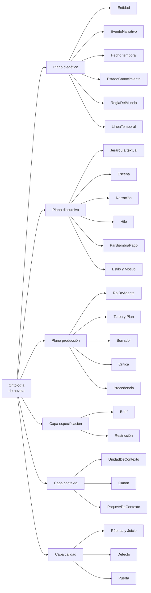
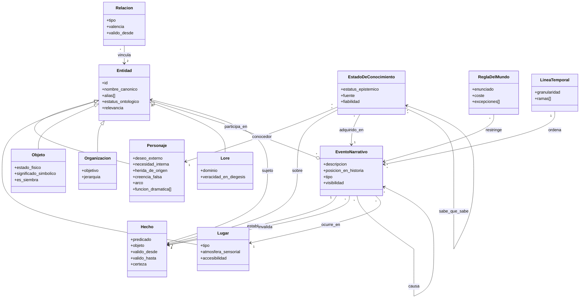
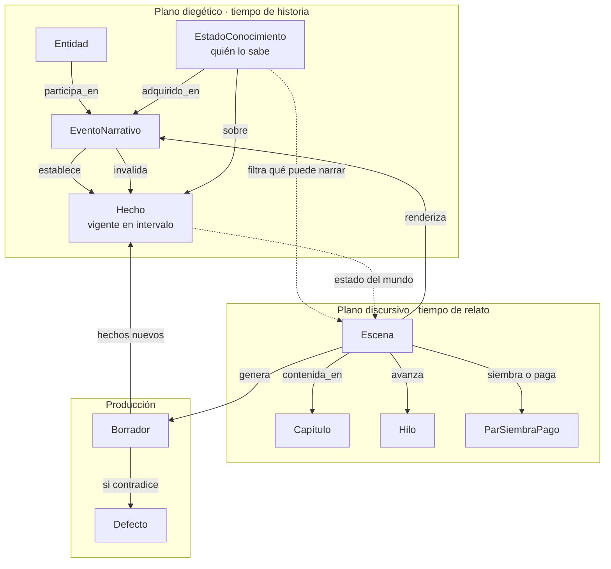
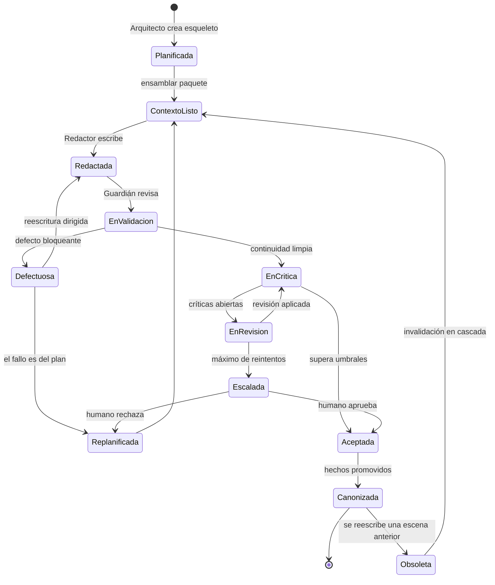
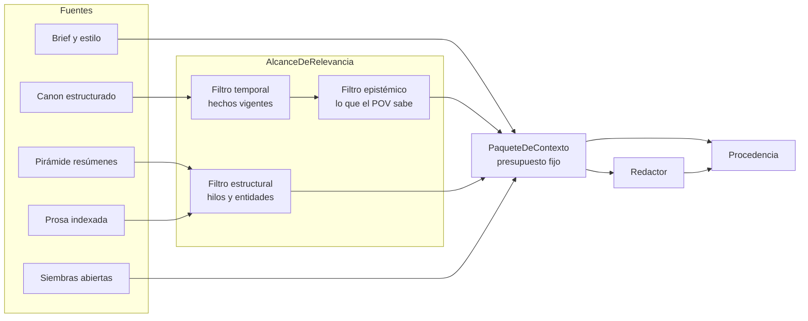
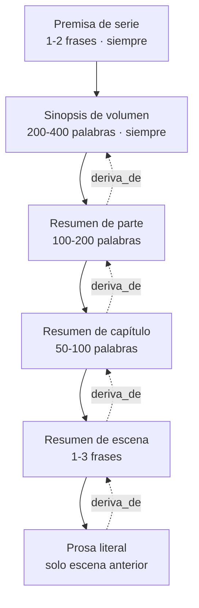
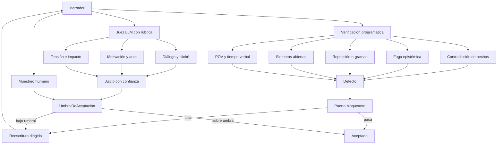
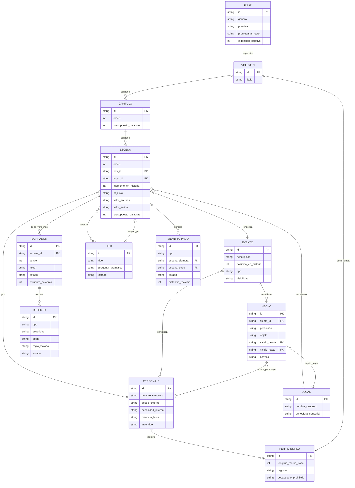

# Ontología para generación agéntica de novelas — Diagramas Mermaid

2026-09-21 · @Nabeel

## Cómo leer estos diagramas

Ocho diagramas Mermaid del mismo modelo, de lo general a lo ejecutable; las definiciones de cada clase están en el documento hermano.

| Diagrama | Tipo | Responde |
| --- | --- | --- |
| 1. Árbol maestro | `flowchart` | ¿Qué hay en el dominio? |
| 2. Plano diegético | `classDiagram` | ¿Cómo se estructura el canon? |
| 3. Plano discursivo | `classDiagram` | ¿Cómo se organiza el relato? |
| 4. Puente entre planos | `flowchart` | ¿Cómo se conectan historia y relato? |
| 5. Ciclo de vida de escena | `stateDiagram-v2` | ¿Cómo avanza el trabajo? |
| 6. Ensamblado de contexto | `flowchart` | ¿Qué ve el agente en cada llamada? |
| 7. Bucle de calidad | `flowchart` | ¿Cómo se valida y cuándo se para? |
| 8. Núcleo mínimo | `erDiagram` | ¿Qué implemento primero? |

El diagrama 8 es el que se puede traducir directamente a esquema. Los demás son para razonar sobre el dominio.

## 1. Árbol taxonómico maestro

Tres planos y tres capas transversales, con las clases de cada uno.

Las subclases de `Entidad` y los niveles de la jerarquía textual se detallan en los diagramas 2 y 3 para no pasar de seis hijos por nivel.

| Nodo agrupador | Contiene |
| --- | --- |
| Entidad | Personaje, Lugar, Objeto, Organización, Lore |
| Jerarquía textual | Serie, Volumen, Parte, Capítulo, Beat, Párrafo |
| Estilo y Motivo | PerfilDeEstilo, Motivo, Tema, PlantillaEstructural |
| Crítica | Revisión, Diff, RegistroDeDecisión |

## 2. Plano diegético

El `EventoNarrativo` es el pivote: establece hechos, los invalida y es el punto de anclaje de toda vigencia temporal.

Tres aristas hacen el trabajo pesado: `establece` e `invalida` delimitan la vigencia de cada hecho, y `adquirido_en` ancla el conocimiento de cada personaje a un punto concreto de la línea temporal. Con esas tres, las contradicciones y las fugas epistémicas son consultas, no lecturas.

## 3. Plano discursivo

La jerarquía contenedora y la `Escena` como unidad de trabajo, con todo lo que la configura.

```mermaid
classDiagram
    class Serie
    class Volumen {
        +presupuesto_palabras
        +promesa_al_lector
    }
    class Parte {
        +acto
        +orden
    }
    class Capitulo {
        +orden
        +presupuesto_palabras
        +gancho_final
    }
    class Escena {
        +pov
        +focalizacion
        +distancia_narrativa
        +tiempo_verbal
        +momento_en_historia
        +objetivo
        +conflicto
        +resultado
        +valor_entrada
        +valor_salida
        +carga_emocional
        +funcion_en_trama
        +tipo
        +presupuesto_palabras
    }
    class Beat {
        +tipo
        +duracion_relativa
        +intencion
    }

    Serie "1" *-- "1..*" Volumen
    Volumen "1" *-- "1..*" Parte
    Parte "1" *-- "1..*" Capitulo
    Capitulo "1" *-- "1..*" Escena
    Escena "1" *-- "1..*" Beat

    class Narracion {
        +persona
        +tipo_narrador
        +fiabilidad
        +acceso_a_conciencias[]
    }
    class Hilo {
        +tipo
        +pregunta_dramatica
        +curva_de_tension[]
        +estado
    }
    class ParSiembraPago {
        +tipo
        +estado
        +sutileza
        +distancia_maxima
    }
    class PlantillaEstructural {
        +beats_esperados[]
        +tolerancia
    }
    class PerfilDeEstilo {
        +longitud_media_frase
        +registro
        +tics_verbales[]
        +vocabulario_prohibido[]
    }
    class Motivo {
        +manifestacion
        +frecuencia_objetivo
    }
    class Tema

    Escena "*" --> "1" Narracion : narrada_por
    Escena "*" --> "1..*" Hilo : avanza
    Escena "*" --> "*" ParSiembraPago : siembra_o_paga
    Escena "*" --> "*" Motivo : manifiesta
    Escena "0..1" --> "1" PlantillaEstructural : conforma_a
    Escena "*" --> "0..1" PerfilDeEstilo : voz_aplicada
    Motivo "*" --> "1" Tema : vehicula
    Hilo "1" --> "0..1" Escena : resuelto_en
```

El par `valor_entrada` / `valor_salida` en la escena es lo que permite comprobar automáticamente que algo cambia. Si son iguales, la escena no está haciendo trabajo narrativo.

## 4. El puente entre planos

Este es el diagrama que conviene tener presente al implementar: muestra cómo un hecho del mundo llega a la página y cómo vuelve al canon.

Las dos flechas punteadas son la clave. `Hecho → Escena` alimenta el contexto con el estado del mundo en ese momento; `EstadoConocimiento → Escena` lo recorta a lo que el POV puede saber.

El ciclo completo es: el evento establece el hecho, la escena renderiza el evento, el borrador verbaliza la escena, y los hechos nuevos del borrador vuelven al canon — o generan un defecto si lo contradicen. Ese retorno es lo que mantiene canon y texto sincronizados.

## 5. Ciclo de vida de una escena

De esqueleto a canon, con los puntos donde el proceso puede pararse.

Dos transiciones que suelen olvidarse y son las que evitan bucles infinitos:

- **`Defectuosa → Replanificada`**: a veces el problema no es la prosa sino el plan. Sin esta salida, el sistema reescribe la misma escena imposible indefinidamente.
- **`EnRevision → Escalada`**: el contador de reintentos convierte un bucle potencialmente infinito en una decisión humana acotada.

Y la transición `Canonizada → Obsoleta` es la que hace del sistema algo revisable: una escena ya canonizada puede volver a la cola si algo anterior cambia.

## 6. Ensamblado del contexto

Qué entra en el paquete que recibe el Redactor, con los tres filtros que lo recortan.

El orden importa: el filtro temporal actúa antes del epistémico. Primero se determina qué es verdad en ese momento, y solo después qué de eso conoce el POV.

### Pirámide de resúmenes

Las flechas punteadas van en sentido inverso a propósito: son las aristas `deriva_de` que permiten la invalidación en cascada. Al reescribir una escena, se sigue esa cadena hacia arriba marcando obsoleto todo lo que dependía de ella.

El efecto buscado es que el paquete tenga tamaño aproximadamente constante en el capítulo 3 y en el 40. Si crece con la longitud del libro, la pirámide no está funcionando.

## 7. Bucle de calidad

Tres vías de verificación con distinta autoridad: solo la programática puede bloquear.

### Reparto de autoridad

| Vía | Puede bloquear | Cuándo corre |
| --- | --- | --- |
| Programática | Sí | En cada borrador |
| Juez LLM | Solo penaliza | En cada borrador |
| Humano | Sí, con excepción autorizada | Por muestreo y en puertas de cierre |

El reparto es deliberado. Un juez LLM con autoridad de bloqueo produce bucles caros e inestables, porque su puntuación varía entre llamadas sobre el mismo texto. Un verificador programático es determinista y por eso puede parar la línea.

## 8. Núcleo mínimo viable

Las 12 clases con las que arrancar, en forma directamente traducible a esquema.

Dos observaciones sobre este esquema. `HECHO.valido_desde` y `valido_hasta` apuntan a `EVENTO`, no a fechas: es lo que hace posible la validación de intervalos. Y `BORRADOR` es la única tabla con texto largo — todo lo demás es estructura consultable.

Falta deliberadamente `ESTADO_CONOCIMIENTO`, que entra en la Fase 2. Cuando se añada, su esquema es `(conocedor_id, hecho_id, estatus, adquirido_en_id, fuente)` con clave compuesta, y habilita la validación de fugas epistémicas descrita en el documento de definiciones.
