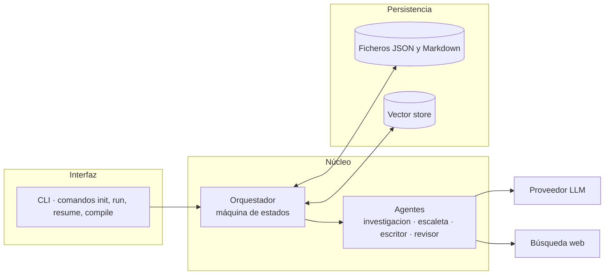

# Especificación técnica · MyStiryMaker

**Versión:** 1.0 (borrador)
**Documento relacionado:** [`especificacion-funcional.md`](./especificacion-funcional.md)

---

## 1. Arquitectura

Cuatro agentes sin estado, un orquestador con estado y una capa de persistencia. Los agentes no se llaman entre sí: todo pasa por el orquestador, que es el único que escribe en memoria.



### Decisión de diseño: agentes sin estado

Cada agente recibe todo su contexto en la llamada y devuelve un objeto tipado. No guarda nada. Esto hace que cualquier paso sea reejecutable y testeable de forma aislada, a cambio de contextos de entrada más grandes.

## 2. Stack propuesto

| Capa | Elección | Motivo |
|---|---|---|
| Lenguaje | Python 3.11+ | Ecosistema de LLM y validación de datos |
| Validación | Pydantic v2 | Los contratos de agente son esquemas, no texto libre |
| Orquestación | Máquina de estados propia (~300 líneas) | El grafo es pequeño; un framework añadiría más peso que valor |
| LLM | API de modelo de lenguaje vía SDK oficial | Salidas estructuradas y contexto largo |
| Vector store | ChromaDB en local | Sin servidor, persistente en disco |
| Persistencia | Ficheros JSON y Markdown en el repositorio | El historial de git es el registro de auditoría |
| CLI | Typer | Comandos legibles |
| Tests | pytest + respuestas de LLM grabadas | Los tests no deben gastar tokens |

Si el proyecto crece a varias novelas en paralelo, el punto de ruptura es la persistencia en ficheros: ahí se migra a SQLite.

## 3. Estructura del repositorio

```
.
├── README.md
├── brief.md
├── specs/
│   ├── README.md
│   ├── especificacion-funcional.md
│   └── especificacion-tecnica.md
├── docs/
│   └── diagrama.drawio
├── src/mystirymaker/
│   ├── cli.py
│   ├── orchestrator.py
│   ├── state.py
│   ├── models.py
│   ├── memory/
│   │   ├── store.py
│   │   └── vectors.py
│   └── agents/
│       ├── base.py
│       ├── research.py
│       ├── outline.py
│       ├── writer.py
│       └── reviewer.py
├── prompts/
│   ├── research.md
│   ├── outline.md
│   ├── writer.md
│   └── reviewer.md
├── memory/
│   ├── bible.json
│   ├── ledger.json
│   └── outline.json
├── research/
├── manuscript/
├── reviews/
├── dist/
├── tests/
├── .env.example
└── pyproject.toml
```

## 4. Modelo de datos

### 4.1 `memory/bible.json`

```json
{
  "version": 3,
  "titulo_trabajo": "El zurdo",
  "voz": {
    "persona": "primera",
    "tiempo": "pasado",
    "muestra": "Párrafo de referencia que fija el registro del narrador.",
    "tics": ["frases cortas tras el impacto", "no nombra el miedo"]
  },
  "temas": ["identidad del que pelea al revés", "coste físico del oficio"],
  "personajes": [
    {
      "id": "prota",
      "nombre": "[NOMBRE]",
      "rol": "protagonista",
      "guardia": "zurda",
      "categoria": "superligero",
      "edad": 27,
      "deseo": "una oportunidad titular antes de los 30",
      "herida": "…",
      "voz": "…",
      "arco": { "acto_1": "…", "acto_2": "…", "acto_3": "…" }
    }
  ],
  "reglas_mundo": [
    "La historia ocurre en el presente, con retransmisión por streaming y patrocinio por redes.",
    "No aparecen boxeadores reales en activo como personajes."
  ],
  "vetos": []
}
```

### 4.2 `memory/ledger.json`

Hechos duros. Es la fuente de verdad para el criterio de continuidad.

```json
{
  "version": 12,
  "record": { "victorias": 14, "derrotas": 1, "empates": 0, "ko": 9 },
  "cronologia": [
    { "capitulo": 6, "fecha_ficcion": "2026-03-14", "evento": "Combate en cartelera preliminar", "resultado": "victoria por decisión unánime" }
  ],
  "combates": [
    { "capitulo": 6, "rival": "[NOMBRE]", "guardia_rival": "ortodoxa", "peso_kg": 63.5, "asaltos": 8, "resultado": "UD" }
  ],
  "lesiones": [
    { "capitulo": 6, "tipo": "corte en ceja izquierda", "estado": "cerrado", "capitulos_afectados": [7, 8] }
  ],
  "hilos_abiertos": [
    { "id": "h-03", "descripcion": "Promesa hecha al entrenador en el cap. 4", "abierto_en": 4, "cerrar_antes_de": 22 }
  ]
}
```

### 4.3 `memory/outline.json`

```json
{
  "version": 5,
  "capitulos": [
    {
      "n": 7,
      "titulo": "Pie contra pie",
      "objetivo": "El protagonista descubre que su ventaja de zurdo ya no sorprende",
      "pov": "prota",
      "conflicto": "El sparring nuevo también es zurdo",
      "salida": "Duda por primera vez de su estilo",
      "contiene_combate": false,
      "palabras_objetivo": 3200,
      "estado": "pendiente",
      "iteraciones": 0
    }
  ]
}
```

`estado` ∈ `pendiente` | `en_revision` | `escalado` | `consolidado`.

### 4.4 `reviews/cap-NN.json`

```json
{
  "capitulo": 7,
  "iteracion": 2,
  "puntuaciones": {
    "tension": 4,
    "verosimilitud_tecnica": 5,
    "avance_arco": 3,
    "prosa": 4,
    "continuidad": 5
  },
  "media": 4.2,
  "veredicto": "aprobado",
  "notas": [
    { "severidad": "media", "ubicacion": "escena 2", "problema": "…", "sugerencia": "…" }
  ],
  "hechos_nuevos": [
    { "tipo": "lesion", "detalle": "molestia en el hombro izquierdo" }
  ]
}
```

## 5. Contratos de agente

Todos heredan de `BaseAgent` y exponen `run(input: Model) -> Model`. La salida se valida con Pydantic; un fallo de validación cuenta como intento fallido y se reintenta una vez con el error inyectado en el prompt.

| Agente | Entrada | Salida | Herramientas |
|---|---|---|---|
| `research` | brief + lista de temas obligatorios | `ResearchPack` (notas + fuentes + marcas de licencia narrativa) | búsqueda web |
| `outline` | brief + `ResearchPack` | `Bible` + `Outline` | ninguna |
| `writer` | `ChapterPlan` + `Bible` + resúmenes previos + notas de revisión (si reescritura) | `ChapterDraft` (markdown + hechos declarados) | recuperación en vector store |
| `reviewer` | `ChapterDraft` + `Bible` + `Ledger` + fragmentos recuperados | `Review` | recuperación en vector store |

### 5.1 Notas sobre el prompt del Escritor

- Recibe los **resúmenes** de los capítulos anteriores, no su texto completo, salvo los dos inmediatamente anteriores.
- Recibe la muestra de voz de la biblia como referencia de registro.
- Se le prohíbe explícitamente inventar hechos duros sin declararlos en el campo `hechos_declarados`.
- En capítulos con combate, recibe además el bloque técnico del zurdo desde `research/`.

### 5.2 Notas sobre el prompt del Revisor

- Puntúa antes de redactar notas, para evitar que la justificación arrastre la puntuación.
- El criterio de continuidad se evalúa contra el ledger inyectado, no contra el recuerdo del texto.
- Las notas deben ser accionables: ubicación, problema y sugerencia. Una nota sin ubicación se rechaza en validación.

## 6. Orquestación

### 6.1 Estados

```
INIT → RESEARCH → OUTLINE → [aprobación autor] → WRITE → REVIEW
  → GATE_CHAPTER → { COMMIT | WRITE | ESCALATED }
  → GATE_REMAINING → { WRITE | COMPILE } → DONE
```

### 6.2 Pseudocódigo del bucle

```python
while (cap := outline.siguiente_pendiente()) is not None:
    notas = []
    for iteracion in range(1, MAX_ITER + 1):
        draft = writer.run(cap, bible, resumenes, notas)
        review = reviewer.run(draft, bible, ledger)
        store.guardar_revision(cap.n, iteracion, review)

        if aprobado(review):                  # RN-01 y RN-02
            memory.consolidar(cap, draft, review.hechos_nuevos)
            outline.marcar(cap.n, "consolidado")
            break

        notas = review.notas
    else:
        outline.marcar(cap.n, "escalado")     # CU-07
        escalar_al_autor(cap, draft, review)
        break

compilar() if outline.todo_consolidado() else detener()
```

### 6.3 Función de aprobación

```python
def aprobado(r: Review) -> bool:
    p = r.puntuaciones
    if p.continuidad <= 2:            # RN-02: rechazo duro
        return False
    if min(p.valores()) < 3:          # RN-01
        return False
    return r.media >= 4.0
```

## 7. Persistencia y recuperación

- **Escritura de memoria**: solo el orquestador, solo en el estado `COMMIT`, de forma atómica (escribir en fichero temporal y renombrar). Cada escritura incrementa `version`.
- **Indexado**: al consolidar, el capítulo se divide en fragmentos de ~800 tokens con solape de 100 y se indexa con metadatos `{capitulo, escena, contiene_combate}`.
- **Recuperación**: el Escritor y el Revisor consultan por similitud limitando a capítulos anteriores al actual, para que no se filtre información futura.
- **Auditoría**: cada consolidación genera un commit con mensaje `cap-NN: consolidado (iteración K, media X.X)`.

## 8. Configuración

Variables en `.env`, nunca en el repositorio. `.env.example` se versiona con placeholders:

```
LLM_API_KEY=TU_CLAVE_AQUI
LLM_MODEL=nombre-del-modelo
LLM_MODEL_REVIEWER=nombre-del-modelo
WEB_SEARCH_API_KEY=TU_CLAVE_AQUI
MAX_ITER=3
PRESUPUESTO_TOTAL_USD=0
CHROMA_PATH=./.chroma
```

`.gitignore` debe incluir `.env`, `.chroma/`, `dist/`.

## 9. Observabilidad y coste

Cada llamada a agente registra una línea en `logs/run-<timestamp>.jsonl`:

```json
{"ts":"…","agente":"writer","capitulo":7,"iteracion":2,"tokens_in":18432,"tokens_out":4210,"coste_usd":0.00,"ms":24100,"ok":true}
```

El orquestador acumula coste y detiene la ejecución al alcanzar `PRESUPUESTO_TOTAL_USD`. Métricas derivadas útiles: iteraciones medias por capítulo (si supera 2, el problema está en la escaleta, no en el Escritor) y distribución de puntuaciones por criterio.

## 10. Errores y reintentos

| Error | Tratamiento |
|---|---|
| Límite de peticiones del proveedor | Reintento con retroceso exponencial, 5 intentos |
| Salida que no valida contra el esquema | 1 reintento con el error de validación en el prompt; luego fallo del paso |
| Capítulo fuera del rango de extensión (RN-09) | Cuenta como rechazo y consume iteración |
| Interrupción del proceso | `resume` relee `outline.json` y continúa desde el primer capítulo no consolidado |
| Contradicción detectada en el ledger | Rechazo duro; no se consolida |

## 11. Estrategia de pruebas

| Nivel | Qué se prueba |
|---|---|
| Unitario | `aprobado()` con las combinaciones frontera de la rúbrica; atomicidad de escritura en memoria |
| Contrato | Cada agente contra respuestas de LLM grabadas; validación de esquemas |
| Integración | Ejecución completa con una escaleta de 3 capítulos y LLM simulado |
| Regresión de continuidad | Capítulo con contradicción inyectada: el Revisor debe puntuar continuidad ≤ 2 |
| Idempotencia | Reconsolidar un capítulo no duplica entradas en el ledger |

## 12. Fases de implementación

| Fase | Entregable | Hecho cuando |
|---|---|---|
| 1 | Modelos y almacén | Los esquemas validan y la escritura es atómica |
| 2 | Agentes Escaleta y Escritor | Se genera un capítulo desde un brief a mano |
| 3 | Agente Revisor y puerta G1 | El bucle de reescritura funciona con máximo 3 iteraciones |
| 4 | Agente Investigación y RAG | El Escritor cita material de `research/` |
| 5 | Orquestador completo, CLI, coste | `run` y `resume` completan una novela de prueba de 5 capítulos |
| 6 | Compilación | `dist/manuscrito.md` sin marcadores de trabajo |

## 13. Deuda aceptada de forma consciente

- Persistencia en ficheros: no soporta ejecución concurrente. Aceptable para un único autor.
- Sin paralelización de capítulos: escribir el capítulo N+1 antes de consolidar el N rompería el ledger. Se descarta a propósito en la v1.
- Rúbrica evaluada por un solo agente: un panel de varios revisores daría una señal más fiable, pero multiplica el coste. Pendiente de revisar si las iteraciones medias bajan de 1,2 (señal de complacencia).
