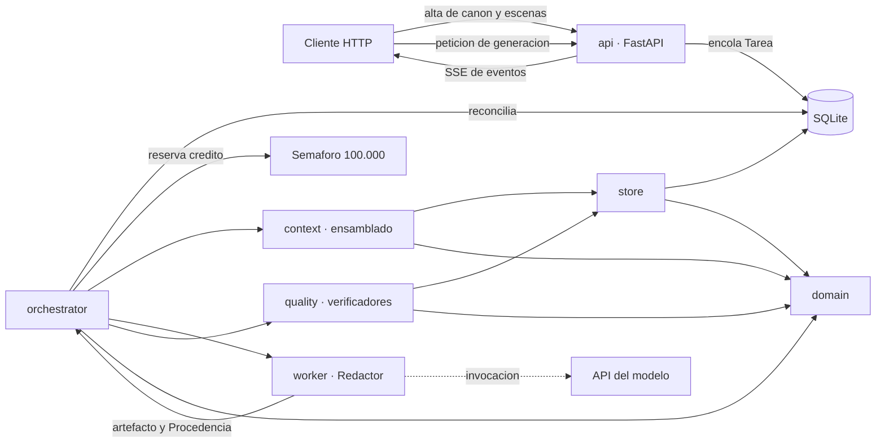

# SPEC-001 · Primera versión del backend — Especificación de requisitos (SRS)

| | |
| --- | --- |
| **Identificador** | SPEC-001 |
| **Título** | Primera versión del backend: núcleo de dominio, canon verificable y bucle de una escena |
| **Estado** | `borrador` — **no aprobada**. Bloqueada por el apartado 12 |
| **Fecha** | 2026-09-22 |
| **Documentos de referencia** | `docs/definitions.md`, `docs/domain-knowledge.md`, `docs/architecture.md`, `docs/verification.md`, `AGENTS.md`, `CLAUDE.md`, en su estado del 2026-09-22 |
| **Fase de adopción** | Fase 1 de `architecture.md` §13, más el DAG mínimo y el semáforo de crédito |

> Este documento es la spec única de `AGENTS.md` §10.2 redactada en forma de SRS: reúne
> en un solo texto el problema, el alcance, los requisitos numerados y comprobables por
> separado, el reparto de verificación, el impacto y los criterios de aceptación. El
> **plan de implementación no está aquí**: según `AGENTS.md` §10.3 se añade al final de
> este mismo documento *después* de que la spec pase a `aprobada`.

---

## 1. Problema

El repositorio contiene hoy cuatro documentos de diseño acordados y ningún código:
`backend/` y `frontend/` solo tienen un `.gitkeep`. Todo lo que `docs/` afirma sobre
coherencia verificable —hechos con vigencia, contradicciones detectables, siembras que no
se quedan abiertas, contexto de tamaño constante— es hoy una intención sin ejecución.

Las consecuencias concretas de esa ausencia:

1. **Ningún invariante existe.** `CLAUDE.md` §7.1 y `AGENTS.md` §10.4 dicen que un invariante
   sin test no existe. No hay tests, luego no hay invariantes: los ocho bloqueantes de
   `definitions.md` son prosa.
2. **No hay dónde poner el canon.** Sin esquema de SQLite ni capa `store/`, no existe la
   fuente de verdad estructurada contra la que se valida nada, y cualquier prueba de
   concepto acabaría guardando canon como prosa —lo que `CLAUDE.md` §3.1 prohíbe.
3. **No hay máquina que ejecute el contrato de los agentes.** `AGENTS.md` §7 describe un
   ciclo de vida de `Tarea`, una escalera de reintentos y una matriz de permisos de
   escritura que hoy nadie aplica. Una matriz de permisos que no se aplica en el
   orquestador es una convención, y las convenciones no sobreviven al primer atajo.
4. **Las cifras de diseño no están medidas.** `architecture.md` §4.2 declara reservas de
   tokens y avisa de que ninguna está medida. Sin una tubería que registre `Procedencia`,
   no hay forma de convertirlas en datos.

Lo que falta no es «un backend»: es el subconjunto mínimo que hace que las comprobaciones
deterministas puedan parar la línea. Mientras no exista, el proyecto solo puede producir
texto plausible sin nada que lo contraste.

---

## 2. Propósito y alcance del documento

### 2.1 Propósito

Especificar, para su aprobación, **qué debe construirse en la primera versión del
backend** y **cómo se comprobará cada requisito**. No describe cómo implementarlo.

### 2.2 Alcance funcional — qué entra

El corte es la **Fase 1** de `architecture.md` §13 más lo que esa misma sección declara no
diferible: el DAG mínimo y el semáforo de crédito, aunque sea con concurrencia 1.

| # | Bloque | Contenido |
| --- | --- | --- |
| A1 | `backend/domain/` | Las 12 clases del núcleo mínimo de `architecture.md` §13 más `Volumen`, sin dependencias de infraestructura |
| A2 | `backend/store/` | SQLite con WAL, esquema inicial, índices obligatorios, repositorios y canon versionado por eventos de cambio |
| A3 | `backend/migrations/` | Migración inicial hacia delante |
| A4 | `backend/quality/` | Verificadores deterministas de la fase 1 y las puertas *Outline aprobado*, *Escena limpia*, *Capítulo cerrado* y *Volumen cerrado* |
| A5 | `backend/context/` | Ensamblado del `PaqueteDeContexto` con recuento de tokens por componente, el orden de componentes del contrato de rol, orden de recorte y `hash` |
| A6 | `backend/orchestrator/` | `Plan` como DAG persistido, bucle de reconciliación, máquina de estados de `Tarea`, escalera de reintentos, semáforo de crédito, matriz de permisos y canonización |
| A7 | `backend/worker/` | Consumidor de la cola con un único rol que invoca modelo: el **Redactor** |
| A8 | `backend/api/` | FastAPI: alta de canon y esqueletos de escena, encolado con `202 Accepted`, SSE de progreso y lectura de borradores, defectos y puertas |
| A9 | Corpus de casos sembrados | Un par de casos por verificador de 4.4: un borrador con el defecto conocido de esa sola dimensión y el mismo borrador con la dimensión intacta. Es el material sobre el que corre 8.4 |

### 2.3 Fuera de alcance — qué no entra

Cada exclusión lleva su motivo. Una exclusión sin motivo se convierte en un olvido.

| Excluido | Motivo |
| --- | --- |
| `EstadoDeConocimiento`, `Narracion` y por tanto **fuga epistémica** y **disciplina de POV** | Fase 2 de `architecture.md` §13. Son dos de los ocho invariantes bloqueantes y su ausencia se declara en 4.4, no se disimula |
| `ReglaDelMundo` y su invariante de violación | No está en el núcleo mínimo de 12 clases; entra con el Worldbuilder |
| Pirámide de `UnidadDeContexto` y resumen progresivo | Fase 3. En v1 el paquete se acota por filtro estructural, no por compresión |
| Índice vectorial (`sqlite-vec`), embeddings y recuperación por similitud | Bloqueado por la pregunta abierta 6 de `architecture.md` §12: el modelo de embeddings determina el DDL, y cambiarlo después es una reindexación completa |
| `Rubrica`, `Juicio`, `UmbralDeAceptacion` y el rol **Juez** | Fase 4. Nada de lo que producen bloquea, así que su ausencia no debilita ninguna puerta |
| `Motivo`, `Tema`, `PlantillaEstructural` | Fase 5 |
| Roles **Arquitecto**, **Worldbuilder**, **Investigador**, **Entrenador de voz**, **Editor de línea**, **Editor de desarrollo** | v1 implementa un solo rol con invocación de modelo para acotar el trabajo de prompts. Los esqueletos de escena, entidades y perfiles de estilo entran por API con los mismos campos obligatorios que `AGENTS.md` §4.2 exige al Arquitecto |
| Puerta *Acto cerrado* | `verification.md` §10 declara que no tiene invariantes enumerados en `definitions.md`. Implementarla hoy sería codificar una intención. *Outline aprobado* sí entra: `verification.md` §4 le asigna dimensiones y v1 puede cobrar tres de ellas (RF-QUA-18) |
| `frontend/` | Esta spec es del backend. La frontera queda fijada en 7 para que el frontend pueda especificarse aparte |
| Política de retención y borrado | Pregunta abierta 7 de `architecture.md` §12. En v1 nada se borra, y eso queda como riesgo declarado en 11 |

### 2.4 Definiciones

Este documento no define clases, roles ni valores de enumeración nuevos, **con una
excepción declarada**: el catálogo de predicados de RF-STO-07, necesario para que
«contradicción de hechos» sea un predicado ejecutable. Su tratamiento está en 9.2.

Todo el vocabulario restante es el de `docs/definitions.md`. Los nombres de clase se
escriben en español y sin sinónimos, según `CLAUDE.md` §5.1.

---

## 3. Descripción general

### 3.1 Contexto del sistema



### 3.2 Bucle que debe quedar cerrado en v1

Es el criterio que ordena todo lo demás: v1 está terminado cuando este recorrido se
ejecuta entero y es reproducible.

```
alta de Brief, Volumen, Capítulo, Personajes, Lugares, Eventos e Hilos por API
  → alta del esqueleto de Escena con sus campos obligatorios
  → petición de generación: se crea un Plan con una Tarea de redacción
  → el orquestador reserva crédito; la capa de contexto ensambla el paquete y lo hashea
  → el worker invoca al Redactor y devuelve prosa + hechos_nuevos_detectados + Procedencia
  → los verificadores deterministas evalúan la puerta Escena limpia
      · limpia     → Borrador aceptado → canonización → revisión de canon + 1
      · defectuosa → escalera de reintentos de architecture.md §6.3 hasta escalado
  → todo el recorrido visible por SSE y reproducible desde la Procedencia archivada
```

### 3.3 Actores

| Actor | Qué hace en v1 |
| --- | --- |
| Persona autora | Da de alta canon y esqueletos de escena, lanza la generación, lee borradores y defectos, resuelve escalados |
| Orquestador | Única autoridad sobre la máquina de estados y sobre la escritura en el canon |
| Worker | Invoca al Redactor e informa del resultado. No decide nada |
| Verificadores de `quality/` | Código determinista. Lo único que puede bloquear una puerta |

### 3.4 Restricciones de diseño heredadas

No se renegocian en esta spec; se citan porque condicionan los requisitos.

- Stack fijado: FastAPI, SQLite, React, techo de 100.000 tokens (`architecture.md` §2.1).
- Las siete reglas no negociables de `CLAUDE.md` §3.
- Los límites de módulos y las seis reglas de dependencia de `architecture.md` §2.3.
- La matriz de permisos de escritura por rol de `AGENTS.md` §2.
- Idioma: clases, campos y enumeraciones en español; funciones y variables en inglés;
  comentarios, docstrings y mensajes de error en español (`CLAUDE.md` §5.3).

### 3.5 Supuestos

Se heredan S-1 a S-8 de `architecture.md` §11 sin cambios. Dos son especialmente
sensibles en v1:

- **S-1** (una novela por proceso, una sola persona autora) sostiene el semáforo en
  memoria y la cola en SQLite. Si cae, cambian RF-ORQ-08 y RF-ORQ-11.
- **S-5** (un solo proceso de backend, sin réplicas) sostiene que un contador en memoria
  acote algo. Si cae, el semáforo tiene que ser distribuido.

Supuestos propios de esta spec. El primero ya está recogido en `architecture.md`
§11; los dos siguientes los abre esta revisión y todavía no están en ningún
documento de `docs/`:

- **S-9.** Una `Escena` de v1 se puede redactar sin filtro epistémico porque su ausencia
  produce falsos negativos —defectos que no se detectan—, no falsos positivos. Si
  resultara falso, es decir, si redactar sin filtro epistémico produjera prosa
  sistemáticamente inservible, la fase 2 dejaría de ser diferible y esta spec habría
  cortado por donde no debía.
- **S-10.** La declaración que emite el Redactor —`hechos_nuevos_detectados`,
  `eventos_narrados`, `siembras_tocadas`— es lo bastante completa para que las
  dimensiones **(E)** de `verification.md` §2 signifiquen algo. Es el supuesto más
  cargado de esta spec: v1 tiene un solo rol con invocación de modelo, así que toda
  su capa bloqueante descansa sobre una declaración suya, y el conjunto congelado que
  permitiría medir su *recall* no existe (`verification.md` §10). Si es falso, la
  capa bloqueante de v1 pasa en verde sin haber evaluado nada. RF-QUA-19 y RF-QUA-20
  no lo desmienten: solo hacen visible el caso extremo.
- **S-11.** La obra de v1 tiene una sola línea temporal, sin `ramas[]`. RF-QUA-02 y
  RF-QUA-03 se implementan sin ese atributo, así que una rama temporal, una realidad
  alternativa o un viaje en el tiempo producirían un defecto crítico falso. Si es
  falso, hace falta el mecanismo de excepción declarada de `verification.md` §4, que
  esa misma sección declara no expresable en la fase 1.

---

## 4. Requisitos

Un requisito por fila, comprobable y fallable por separado. La columna *Origen* cita el
documento que lo impone, para que un cambio en `docs/` se note aquí.

### 4.1 Dominio — `backend/domain/`

| ID | Requisito | Origen |
| --- | --- | --- |
| RF-DOM-01 | Existen como tipos del dominio las 12 clases del núcleo mínimo —`Brief`, `Personaje`, `Lugar`, `EventoNarrativo`, `Hecho`, `Escena`, `Capitulo`, `Hilo`, `ParSiembraPago`, `PerfilDeEstilo`, `Borrador`, `Defecto`— más `Volumen` | `architecture.md` §13 |
| RF-DOM-02 | Existen como tipos del dominio las clases de producción que la ejecución necesita: `Tarea`, `Plan`, `Puerta`, `Procedencia`, `PaqueteDeContexto` y `RegistroDeDecision` | `definitions.md` §Producción; `architecture.md` §6.4 |
| RF-DOM-03 | Cada vocabulario controlado de `definitions.md` que v1 usa es una enumeración cerrada del dominio; un valor fuera de ella es un error de construcción, no una cadena aceptada | `definitions.md` §Vocabularios; `CLAUDE.md` §5.2 |
| RF-DOM-04 | Construir una `Escena` con `valor_de_entrada` igual a `valor_de_salida` falla en el dominio, antes de llegar a la base de datos | `definitions.md` §Escena |
| RF-DOM-05 | Construir una `Escena` sin al menos una arista `renderiza` hacia un `EventoNarrativo` falla | `definitions.md` §Escena |
| RF-DOM-06 | Un `Hecho` exige `valido_desde` apuntando a un `EventoNarrativo`; `valido_hasta` es opcional y nulo significa vigente. No admite fechas sueltas | `CLAUDE.md` §3.2 |
| RF-DOM-07 | Ninguna clase del dominio expone atributos estáticos para dimensiones variables (ubicación, lealtad, salud, posesión, estado emocional): esas son `Hecho` | `CLAUDE.md` §3.2 |
| RF-DOM-08 | Los mensajes de error del dominio están en español y nombran la clase y el invariante violado | `CLAUDE.md` §5.3 |

### 4.2 Almacenamiento — `backend/store/` y `backend/migrations/`

| ID | Requisito | Origen |
| --- | --- | --- |
| RF-STO-01 | Toda conexión abierta por `store/` tiene `journal_mode=WAL` y `foreign_keys=ON` | `architecture.md` §3.1 |
| RF-STO-02 | El esquema inicial se crea por migración versionada y hacia delante; no hay creación implícita de tablas al arrancar | `architecture.md` §2.3, §3.1 |
| RF-STO-03 | Existen los índices sobre `HECHO(sujeto_id, predicado)` y sobre `EVENTO(posicion_en_historia)`. El de `ESTADO_CONOCIMIENTO(conocedor_id, hecho_id)` queda para la fase 2, con su tabla | `architecture.md` §3.1 |
| RF-STO-04 | `store/` es el único paquete que abre una conexión a SQLite; el resto accede por repositorios tipados | `architecture.md` §2.3 |
| RF-STO-05 | El canon se versiona guardando eventos de cambio; la revisión *N* se reconstruye sin copiar el canon entero por revisión | `architecture.md` §3.1 |
| RF-STO-06 | La escritura de un artefacto y la transición de estado de su `Tarea` ocurren en la misma transacción | `architecture.md` §6.4 D-04; `AGENTS.md` §7.4 |
| RF-STO-07 | Existe un catálogo declarado de predicados de `Hecho` con su exclusividad —`funcional`, a lo sumo un valor vigente por sujeto, o `multivalor`—. Un predicado no catalogado se rechaza al canonizar | Esta spec, 9.2 |
| RF-STO-08 | Las consultas transitivas sobre el grafo causal de `EventoNarrativo` se resuelven con CTEs recursivas dentro de `store/`, no reconstruyendo el grafo en memoria | `architecture.md` §3.1 |
| RF-STO-09 | Ninguna tabla del canon admite prosa. El único texto largo del esquema es `BORRADOR.texto` | `CLAUDE.md` §3.1 |
| RF-STO-10 | La migración inicial siembra el catálogo `PREDICADO` con el conjunto de partida de 9.2. El catálogo nunca queda vacío al arrancar: con él vacío, RF-STO-07 rechaza toda canonización y el bucle de 3.2 no puede cerrarse | Esta spec, 9.2 |

### 4.3 Contexto — `backend/context/`

| ID | Requisito | Origen |
| --- | --- | --- |
| RF-CTX-01 | El ensamblador construye el `PaqueteDeContexto` con los componentes en el orden del contrato de rol —estático, estado del mundo, continuidad, arco, voz, epistémico, promesas, instrucción, y los defectos abiertos al final—, y ese orden es parte del contrato | `AGENTS.md` §4.5; `architecture.md` §4.7 D-16 |
| RF-CTX-02 | El ensamblador cuenta los tokens **antes** de invocar y almacena el recuento real por componente en el `PaqueteDeContexto` | `architecture.md` §4.4 |
| RF-CTX-03 | Un paquete que excede su presupuesto no se trunca: la `Tarea` pasa a `bloqueada` con `falta`. En ningún caso se recorta por la cola | `architecture.md` §4.1, §4.5 D-12 |
| RF-CTX-04 | El recorte por componente sigue el orden fijo de `architecture.md` §4.5, y los componentes *estático*, *instrucción* y *epistémico* no se recortan nunca | `architecture.md` §4.5 D-12 |
| RF-CTX-05 | El filtro temporal —hechos vigentes en el `momento_en_historia` de la escena— se aplica antes que cualquier filtro posterior, y el punto de inserción del filtro epistémico queda explícito aunque en v1 no filtre nada | `architecture.md` §4.4 |
| RF-CTX-06 | El `PaqueteDeContexto` referencia la revisión de canon con la que se construyó y lleva un `hash` estable: mismo canon, misma escena y misma versión de prompt producen el mismo hash | `architecture.md` §9 |
| RF-CTX-07 | El paquete se reconstruye entero desde el store en cada invocación; no existe historial acumulativo entre intentos | `architecture.md` §3.2 D-09 |
| RF-CTX-08 | El paquete de una tarea de redacción no supera 25.000 tokens de entrada, con el techo del sistema en 100.000 | `architecture.md` §4.1 |

### 4.4 Calidad — `backend/quality/`

Los verificadores de v1 y, explícitamente, los que no están. Cinco de los ocho invariantes
bloqueantes de `definitions.md` quedan cubiertos; los otros tres se declaran ausentes en
RF-QUA-14, para que nadie los dé por cubiertos.

Tres de los que sí entran son dimensiones **(E)** de `verification.md` §2: su predicado es
determinista, pero su entrada la declara el Redactor leyendo su propia prosa. RF-QUA-01
depende de `hechos_nuevos_detectados`, RF-QUA-04 de los eventos renderizados y RF-QUA-08
del reconocimiento de nombres propios. RF-QUA-19 y RF-QUA-20 existen por eso, y el
supuesto que lo sostiene es S-10.

| ID | Requisito | Severidad | Origen |
| --- | --- | --- | --- |
| RF-QUA-01 | Detecta contradicción de hechos: dos hechos con el mismo sujeto y un predicado `funcional` con intervalos de vigencia solapados | crítica | `definitions.md` bloqueante 3 |
| RF-QUA-02 | Detecta ciclos en el grafo causal de `EventoNarrativo` | crítica | `definitions.md` bloqueante 1 |
| RF-QUA-03 | Detecta que A causa B sin que A preceda a B en `posicion_en_historia` | crítica | `definitions.md` bloqueante 2 |
| RF-QUA-04 | Detecta escena sin cambio de valor o sin evento renderizado, también sobre datos ya persistidos | crítica | `definitions.md` bloqueante 7 y §Escena |
| RF-QUA-05 | Detecta más de un `Borrador` en estado `aceptado` para la misma escena | crítica | `definitions.md` bloqueante 8 |
| RF-QUA-06 | Detecta `ParSiembraPago` en estado `abierto` pasada su `distancia_maxima_aceptable`, y cualquiera abierto al cierre del volumen | media, y crítica al cierre | `definitions.md` §ParSiembraPago; `verification.md` §4 |
| RF-QUA-07 | Detecta desvío del presupuesto de palabras del capítulo por encima de su margen | baja | `verification.md` §4 |
| RF-QUA-08 | Detecta deriva de nombres: un nombre propio del borrador que no corresponde a ninguna entidad del canon ni a un alias declarado | alta | `verification.md` §4 |
| RF-QUA-09 | Detecta repetición de trigramas y tetragramas del borrador contra los capítulos anteriores por encima del umbral | media | `definitions.md` §Dimensiones verificables |
| RF-QUA-10 | Todo `Defecto` emitido lleva `tipo`, `span`, `regla_violada`, `severidad` y `evidencia` citable. Un defecto sin evidencia se descarta antes de llegar al Orquestador, y el descarte queda contado | — | `verification.md` §3 |
| RF-QUA-11 | La puerta *Escena limpia* es bloqueante y cobra RF-QUA-01 a RF-QUA-05 | — | `verification.md` §6 |
| RF-QUA-12 | La puerta *Capítulo cerrado* es bloqueante y cobra, sobre el capítulo ya cerrado, la reejecución de las dimensiones de escena de 4.4, más RF-QUA-09 y RF-QUA-07 | — | `verification.md` §6 |
| RF-QUA-13 | La puerta *Volumen cerrado* es bloqueante y cobra RF-QUA-06, todo hilo con resolución o abandono declarado y, para los de `tipo` principal, que su `pregunta_dramatica` tenga escena de resolución declarada y no abandono | — | `verification.md` §6; `definitions.md` cierre 2 y 3 |
| RF-QUA-14 | Las puertas declaran como **evidencia ausente**, nunca como aprobado, los invariantes bloqueantes que v1 no implementa: fuga epistémica, disciplina de POV y violación de `ReglaDelMundo`. La proporción de puertas cerradas con evidencia ausente queda contada y es consultable | — | `architecture.md` §6.5; `verification.md` §12 V-04 |
| RF-QUA-15 | Ningún verificador de `quality/` consulta el índice vectorial por ninguna ruta | — | `architecture.md` §3.1 |
| RF-QUA-16 | Detecta `Hilo` sin `pregunta_dramatica` declarada | crítica | `verification.md` §4 alcance de contrato |
| RF-QUA-17 | Detecta `Personaje` de `relevancia` protagónica sin `Hilo` asociado, o con `necesidad_interna` vacía | crítica | `definitions.md` §Personaje; `verification.md` §4 |
| RF-QUA-18 | La puerta *Outline aprobado* es bloqueante y cobra RF-QUA-07, RF-QUA-16 y RF-QUA-17. Declara evidencia ausente para conformidad estructural y para restricciones y políticas de contenido, que quedan fuera del alcance de v1 | — | `verification.md` §6 |
| RF-QUA-19 | El `Defecto` de una dimensión **(E)** cita en su `evidencia` el bloque declarado contra el que se evaluó, no solo el span del texto | alta | `verification.md` §2 y §11 F-01 |
| RF-QUA-20 | Un `Borrador` cuyo bloque `hechos_nuevos_detectados` llega vacío no supera *Escena limpia* en silencio: la puerta registra RF-QUA-01 como evidencia ausente en lugar de como superada | — | `verification.md` §11 F-01; `architecture.md` §1 principio 8 |

### 4.5 Orquestación — `backend/orchestrator/`

| ID | Requisito | Origen |
| --- | --- | --- |
| RF-ORQ-01 | El `Plan` es un DAG de `Tarea`s persistido en SQLite antes de ejecutar nada. Si contiene un ciclo se rechaza el plan entero; no se rompe el ciclo por heurística | `architecture.md` §6.4 D-01; `AGENTS.md` §7.2 |
| RF-ORQ-02 | Una `Tarea` pasa a `lista` cuando, y solo cuando, todas sus `depende_de` están `aceptada` | `AGENTS.md` §7.1 |
| RF-ORQ-03 | Las transiciones de estado de `Tarea` las escribe únicamente el Orquestador. El worker informa del resultado y no decide estado | `architecture.md` §6.4 D-02 |
| RF-ORQ-04 | La máquina de estados de `Tarea` implementa exactamente el vocabulario cerrado de `AGENTS.md` §7.1, y ninguna transición fuera de él | `AGENTS.md` §7.1 |
| RF-ORQ-05 | La escalera de reintentos es la de `architecture.md` §6.3: reescritura, reescritura con contexto ampliado, replanificación y escalado a humano | `architecture.md` §6.3 |
| RF-ORQ-06 | Dos intentos consecutivos con el mismo tipo de `Defecto` saltan directamente a replanificación | `architecture.md` §6.3; `AGENTS.md` §4.1 |
| RF-ORQ-07 | Los fallos se clasifican en transporte, contrato, contenido y presupuesto antes de reaccionar; solo contrato y contenido suman intento narrativo | `architecture.md` §6.5 D-06 |
| RF-ORQ-08 | Un semáforo de crédito de 100.000 unidades concede reserva antes de invocar y la libera en **toda** ruta de salida: éxito, fallo, timeout y cancelación | `architecture.md` §6.6 D-14 |
| RF-ORQ-09 | La reserva concedida se concilia después contra el uso real registrado en `Procedencia`, y la desviación queda registrada por clase de tarea | `architecture.md` §6.6 |
| RF-ORQ-10 | Una reserva mayor que el crédito total se rechaza como error de planificación; no se encola | `architecture.md` §6.6 D-15 |
| RF-ORQ-11 | La cola ordena por las cuatro clases de prioridad P0–P3 con envejecimiento; una tarea que espera por encima del umbral configurado sube de clase | `architecture.md` §6.6 |
| RF-ORQ-12 | Hay tres timeouts configurables —por invocación, por `Tarea` incluidos sus reintentos, y por `Plan`—, y un vencimiento libera la reserva y se trata como fallo de contrato | `architecture.md` §6.5 D-07 |
| RF-ORQ-13 | Reejecutar con la clave `(plan, objetivo, revision_de_canon, hash_del_paquete, version_de_prompt, intento)` devuelve el artefacto ya producido sin volver a invocar el modelo | `AGENTS.md` §7.4 |
| RF-ORQ-14 | Al arrancar, toda `Tarea` que quedó `en_curso` sin `Procedencia` vuelve a `lista` y suma un intento; si la `Procedencia` está registrada y el artefacto no, queda anotada como pagada y perdida | `AGENTS.md` §7.4 |
| RF-ORQ-15 | La matriz de permisos de escritura de `AGENTS.md` §2 se aplica en el orquestador: un artefacto de una clase que el rol no puede escribir se rechaza | `CLAUDE.md` §3.4; `verification.md` §8 |
| RF-ORQ-16 | Cancelar una `Tarea` cancela su subárbol de dependientes y marca `obsoleto` lo ya producido. Nada se borra | `AGENTS.md` §7.5 |
| RF-ORQ-17 | Si la revisión del canon cambia mientras una `Tarea` está `en_curso`, su resultado se descarta al volver | `AGENTS.md` §7.5 |
| RF-ORQ-18 | Las canonizaciones se serializan: el Orquestador toma la revisión del canon como recurso exclusivo | `AGENTS.md` §7.2 |
| RF-ORQ-19 | Cada transición de estado emite un evento con marca de tiempo, disponible para su retransmisión por SSE | `architecture.md` §9 |
| RF-ORQ-20 | No hay degradación automática de modelo, de prompt ni de paquete. Bajo presión el sistema va más lento, nunca peor | `architecture.md` §6.5 D-08 |

### 4.6 Canonización

| ID | Requisito | Origen |
| --- | --- | --- |
| RF-CAN-01 | Solo promueve un `Borrador` que haya superado la puerta *Escena limpia*. Es el único punto de promoción a memoria larga | `architecture.md` §3.3 D-11 |
| RF-CAN-02 | Normaliza sujeto, predicado y objeto de cada `hechos_nuevos_detectados` contra las entidades existentes, por nombre canónico y alias declarados. Lo que no normaliza produce `Defecto`, no una entidad nueva | `AGENTS.md` §4.10 |
| RF-CAN-03 | Deduplica de forma exacta por clave natural —sujeto, predicado, objeto e intervalo—. Un duplicado exacto no se inserta | `architecture.md` §3.3 |
| RF-CAN-04 | Una sucesión legítima cierra el intervalo anterior con `valido_hasta` en el evento correspondiente. Una contradicción genera un `Defecto` y **nunca** sobrescribe canon | `architecture.md` §3.3; `AGENTS.md` §4.10 |
| RF-CAN-05 | Una canonización correcta incrementa la revisión del canon en uno | `AGENTS.md` §4.10 |
| RF-CAN-06 | La invalidación en cascada —hechos que la escena establecía y `PaqueteDeContexto` que la citaban— es parte del cierre de la canonización, en su misma transacción, no un trabajo posterior | `architecture.md` §4.6; `AGENTS.md` §7.5 |

### 4.7 Worker — `backend/worker/` y `backend/agents/`

| ID | Requisito | Origen |
| --- | --- | --- |
| RF-WRK-01 | El worker consume la cola, invoca al modelo y devuelve el resultado con su `Procedencia`. No escribe estado de `Tarea`, no elige la siguiente y no decide reintentar | `architecture.md` §6.4 D-02 |
| RF-WRK-02 | El worker describe su fallo con precisión suficiente para que el Orquestador lo clasifique en una de las cuatro clases de RF-ORQ-07 | `architecture.md` §6.5 |
| RF-WRK-03 | Cada invocación registra `Procedencia` con agente, modelo, versión de prompt, hash del paquete, parámetros de muestreo, coste, latencia y clase de fallo si lo hubo | `CLAUDE.md` §3.5; `architecture.md` §9 |
| RF-WRK-04 | La salida del rol se valida contra el esquema del contrato común de `AGENTS.md` §3. Una salida que no valida, o truncada al alcanzar el techo de tokens, es fallo de contrato | `AGENTS.md` §3; `architecture.md` §6.5 |
| RF-WRK-05 | `contexto_insuficiente: true` devuelve `resultado: null` con la lista `falta`, y el Orquestador reconstruye el paquete o replanifica. El agente no inventa | `AGENTS.md` §3 |
| RF-WRK-06 | El rol **Redactor** está implementado con su prompt versionado en `backend/agents/redactor/prompts/`, y emite prosa más `hechos_nuevos_detectados`, `eventos_narrados`, `siembras_tocadas` y `recuento_palabras` | `AGENTS.md` §4.5 |
| RF-WRK-07 | Un prompt editado sin incrementar su versión semántica se detecta: el hash del fichero cambia y la versión no | `AGENTS.md` §8; `verification.md` §8 |
| RF-WRK-08 | Ningún registro de ejecución contiene prosa; los registros referencian el id del `Borrador` | `architecture.md` §9 |

### 4.8 API — `backend/api/`

| ID | Requisito | Origen |
| --- | --- | --- |
| RF-API-01 | Alta y lectura de `Brief`, `Volumen`, `Capitulo`, `Personaje`, `Lugar`, `EventoNarrativo`, `Hilo`, `ParSiembraPago` y `PerfilDeEstilo` | 3.2 |
| RF-API-02 | Alta de esqueleto de `Escena` exigiendo los campos obligatorios de `AGENTS.md` §4.2, incluido `hechos_requeridos`. Si falta cualquiera, se rechaza con `422` | `AGENTS.md` §4.2 |
| RF-API-03 | Los endpoints de generación crean una `Tarea` y devuelven `202 Accepted` con su id. Ninguno bloquea hasta terminar | `architecture.md` §2.2 |
| RF-API-04 | `GET /tareas/{id}/eventos` retransmite por SSE las transiciones de estado. El cliente no hace *polling* | `architecture.md` §9 |
| RF-API-05 | Lectura de borradores por escena con sus versiones, de defectos por borrador y del resultado de cada puerta | `CLAUDE.md` §2.3 |
| RF-API-06 | Los esquemas Pydantic son la frontera de serialización; las clases del dominio no se exponen ni se serializan directamente | `CLAUDE.md` §2.3 |
| RF-API-07 | `api/` no alcanza al cliente de modelo por ninguna ruta: encola `Tarea` y lee estado | `architecture.md` §2.3, §6 |

### 4.9 Requisitos no funcionales y estructurales

| ID | Requisito | Origen |
| --- | --- | --- |
| RNF-01 | `domain/` no importa de ningún otro paquete, ni de FastAPI ni de Pydantic | `architecture.md` §2.3 |
| RNF-02 | `quality/` importa de `domain/` y nunca de `agents/` | `architecture.md` §2.3 |
| RNF-03 | `agents/` no importa de `agents/` | `architecture.md` §2.3 |
| RNF-04 | El crédito total del semáforo es 100.000 y el grado de paralelismo por defecto es 1, configurable | `architecture.md` §4.1, §13 |
| RNF-05 | Se registran cuatro de las cinco señales de `architecture.md` §9: reintentos por tipo de `Defecto`, deriva entre reserva y uso real, tokens por componente, y tiempo en cola por prioridad | `architecture.md` §9 |
| RNF-06 | `uv run pytest`, `uv run pytest -m invariants`, `ruff check`, `ruff format --check` y `mypy backend/` pasan en verde | `CLAUDE.md` §6 |
| RNF-07 | Todo invariante de 4.4 tiene un test que se ha visto fallar por el motivo correcto antes de implementarlo | `AGENTS.md` §10.4 |
| RNF-08 | Los comandos de `CLAUDE.md` §6 funcionan tal como están escritos al cerrar el cambio | `CLAUDE.md` §6 |

---

## 5. Modelo de datos

Las tablas del esquema inicial. El DDL concreto —tipos, claves foráneas y restricciones
`CHECK` de las enumeraciones— se escribe en la migración durante la implementación; aquí
se fija qué existe y qué no.

### 5.1 Canon y estructura

| Tabla | Notas |
| --- | --- |
| `BRIEF` | `genero`, `premisa`, `promesa_al_lector`, `extension_objetivo` |
| `VOLUMEN` | `titulo`, `presupuesto_palabras`, `perfil_estilo_id` |
| `CAPITULO` | `volumen_id`, `orden`, `presupuesto_palabras` |
| `ESCENA` | `capitulo_id`, `orden`, `pov_id`, `lugar_id`, `momento_en_historia`, `objetivo`, `conflicto`, `resultado`, `valor_entrada`, `valor_salida`, `funcion_en_trama`, `tipo`, `presupuesto_palabras` |
| `PERSONAJE` | `nombre_canonico`, `alias`, `relevancia`, `deseo_externo`, `necesidad_interna`, `creencia_falsa`, `arco_tipo`, `perfil_estilo_id`. `relevancia` es el atributo de `Entidad` que RF-QUA-17 necesita |
| `LUGAR` | `nombre_canonico`, `alias`, `atmosfera_sensorial` |
| `EVENTO` | `descripcion`, `posicion_en_historia`, `tipo`, `visibilidad`, `lugar_id` |
| `HECHO` | `sujeto_id`, `predicado`, `objeto`, `valido_desde` → `EVENTO`, `valido_hasta` → `EVENTO` (nulo = vigente), `certeza`, `establecido_en` → `ESCENA` |
| `PREDICADO` | Catálogo de RF-STO-07: `nombre`, `exclusividad`, `descripcion` |
| `HILO` | `tipo`, `pregunta_dramatica`, `estado`, `resuelto_en` → `ESCENA` |
| `SIEMBRA_PAGO` | `tipo`, `escena_siembra`, `escena_pago`, `estado`, `distancia_maxima` |
| `PERFIL_ESTILO` | `longitud_media_frase`, `registro`, `vocabulario_prohibido` |
| `ESCENA_EVENTO` | Arista `renderiza`, con la cardinalidad `1..*` de RF-DOM-05 |
| `ESCENA_HILO` | Arista `avanza` |
| `EVENTO_PARTICIPANTE` | `evento_id`, `entidad_id`, `rol_en_evento` |
| `EVENTO_CAUSA` | Arista `causa`, sobre la que operan RF-QUA-02 y RF-QUA-03 |
| `CANON_REVISION` | Revisión actual y eventos de cambio de RF-STO-05 |

### 5.2 Producción y ejecución

| Tabla | Notas |
| --- | --- |
| `BORRADOR` | `escena_id`, `version`, `texto`, `estado`, `recuento_palabras`, `procedencia_id`. Única tabla con texto largo |
| `HECHO_DETECTADO` | Los `hechos_nuevos_detectados` declarados por el Redactor, pendientes de canonizar |
| `DEFECTO` | `tipo`, `severidad`, `span`, `evidencia`, `regla_violada`, `estado`, `detectado_por` |
| `PLAN` | Contenedor del DAG, con su techo de coste |
| `TAREA` | `plan_id`, `tipo`, `rol_asignado`, `estado`, `prioridad`, `intentos_narrativos`, `intentos_infraestructura`, `presupuesto`, `reserva`, `paquete_id`, `falta` |
| `TAREA_DEPENDENCIA` | Aristas `depende_de` del DAG |
| `TAREA_EVENTO` | Transiciones con marca de tiempo; origen del SSE de RF-API-04 |
| `PUERTA` | `fase`, `politica`, `resultado`, `evidencia_ausente` (RF-QUA-14) |
| `PAQUETE_CONTEXTO` | `tarea_id`, `revision_canon`, `hash`, recuento de tokens por componente |
| `PROCEDENCIA` | `agente`, `modelo`, `version_de_prompt`, `paquete_id`, `parametros_muestreo`, `coste`, `latencia`, `timestamp` |
| `REGISTRO_DECISION` | Inmutable: `decision`, `alternativas`, `motivo`, `ambito`, `reversible`, `tomada_en` |

### 5.3 Índices obligatorios

`HECHO(sujeto_id, predicado)` y `EVENTO(posicion_en_historia)`, según RF-STO-03.

---

## 6. Interfaz de la API

Forma de los endpoints de v1. Los esquemas concretos se definen con Pydantic durante la
implementación.

| Método y ruta | Qué hace | Respuesta |
| --- | --- | --- |
| `POST /brief`, `/volumenes`, `/capitulos`, `/personajes`, `/lugares`, `/eventos`, `/hilos`, `/siembras`, `/perfiles-estilo` | Alta de canon y estructura | `201` |
| `POST /escenas` | Alta de esqueleto con los campos obligatorios de RF-API-02 | `201`, o `422` si falta alguno |
| `GET /escenas/{id}` | Escena con sus aristas y su estado | `200` |
| `POST /escenas/{id}/redactar` | Crea `Plan` y `Tarea` de redacción | `202` con `tarea_id` |
| `GET /tareas/{id}` | Estado, intentos, reserva y `falta` | `200` |
| `GET /tareas/{id}/eventos` | SSE de transiciones | `200`, `text/event-stream` |
| `POST /tareas/{id}/cancelar` | Cancela la tarea y su subárbol | `202` |
| `GET /escenas/{id}/borradores` | Versiones con su estado | `200` |
| `GET /borradores/{id}/defectos` | Defectos con su evidencia | `200` |
| `GET /puertas` | Resultado de puertas por ámbito, incluida la evidencia ausente | `200` |
| `POST /escalados/{tarea_id}/resolver` | Resolución humana del intento 4: aprueba o rechaza | `200` |

---

## 7. Frontera con el frontend

Queda fijada aquí aunque el frontend esté fuera de alcance, porque condiciona la API:

- Toda validación ocurre en el backend. El frontend que necesite decidir si algo es
  válido llama a la API (`CLAUDE.md` §2.3).
- El progreso llega por SSE. El frontend no hace *polling* ni infiere progreso.
- Ningún invariante se duplica en JavaScript.

---

## 8. Verificación

Por requisito: metodología concreta, clase del marco T/A/I/D/U, `modo_de_verificacion` de
`definitions.md` y autoridad. El reparto sigue `verification.md`: **solo lo determinista
bloquea**.

### 8.1 Dominio

| ID | Metodología | Clase | Modo | Autoridad |
| --- | --- | --- | --- | --- |
| RF-DOM-01, RF-DOM-02 | Comprobación de tipos (`mypy`) más un test de presencia por clase | A | `programa` | Bloqueante |
| RF-DOM-03 | Prueba unitaria por enumeración: un valor fuera del vocabulario falla | T | `programa` | Bloqueante |
| RF-DOM-04, RF-DOM-05 | Prueba unitaria en rojo primero: construcción inválida que debe fallar | T | `programa` | Bloqueante |
| RF-DOM-06, RF-DOM-07 | Análisis estático de los tipos del dominio: ningún campo de fecha suelta ni atributo estático de dimensión variable | A | `programa` | Bloqueante |
| RF-DOM-08 | Inspección en revisión de código sobre los mensajes de error | I | `humano` | Bloqueante |

### 8.2 Almacenamiento

| ID | Metodología | Clase | Modo | Autoridad |
| --- | --- | --- | --- | --- |
| RF-STO-01 | Prueba unitaria sobre la factoría de conexiones: `PRAGMA journal_mode` y `foreign_keys` | T | `programa` | Bloqueante |
| RF-STO-02 | Prueba de integración: base vacía → migración → esquema esperado | T | `programa` | Bloqueante |
| RF-STO-03 | Prueba de integración sobre el plan de consulta de las validaciones más frecuentes | T | `programa` | Advertencia |
| RF-STO-04 | Análisis estático del grafo de importaciones: `sqlite3` no se alcanza fuera de `store/` | A | `programa` | Bloqueante |
| RF-STO-05 | Pruebas basadas en propiedades: reconstruir la revisión *N* y compararla con el estado en *N* | T | `programa` | Bloqueante |
| RF-STO-06 | Prueba de integración con fallo inyectado entre artefacto y transición: no queda escrito ninguno de los dos | T | `programa` | Bloqueante |
| RF-STO-07 | Prueba unitaria: un predicado no catalogado se rechaza al canonizar | T | `programa` | Bloqueante |
| RF-STO-08 | Prueba de integración sobre un grafo causal profundo, comparada con el resultado esperado | T | `programa` | Bloqueante |
| RF-STO-09 | Inspección del esquema en revisión de código, más análisis estático de las columnas de texto | I / A | `humano` | Bloqueante |
| RF-STO-10 | Prueba de integración: base vacía → migración → el catálogo trae el conjunto de partida, y una canonización de prueba no se rechaza por predicado no catalogado | T | `programa` | Bloqueante |

### 8.3 Contexto

| ID | Metodología | Clase | Modo | Autoridad |
| --- | --- | --- | --- | --- |
| RF-CTX-01 | Prueba unitaria sobre el orden de componentes del paquete ensamblado | T | `programa` | Bloqueante |
| RF-CTX-02 | Prueba unitaria: el recuento almacenado coincide con el contado antes de invocar | T | `programa` | Bloqueante |
| RF-CTX-03 | Prueba unitaria con un paquete por encima del presupuesto: la tarea queda `bloqueada` con `falta` y no se invoca al modelo | T | `programa` | Bloqueante |
| RF-CTX-04 | Prueba unitaria por escalón del orden de recorte, más un caso que confirma que los tres intocables no se tocan | T | `programa` | Bloqueante |
| RF-CTX-05 | Prueba unitaria con un hecho invalidado antes del `momento_en_historia`: no entra en el paquete | T | `programa` | Bloqueante |
| RF-CTX-06 | *Replay* desde una `Procedencia` archivada: misma revisión, mismo hash | T | `programa` | Bloqueante |
| RF-CTX-07 | Prueba unitaria: el paquete del intento 2 no contiene el borrador rechazado del intento 1 | T | `programa` | Bloqueante |
| RF-CTX-08 | Pruebas basadas en propiedades sobre escenas con distinta cantidad de canon previo | T | `programa` | Bloqueante |

### 8.4 Calidad

| ID | Metodología | Clase | Modo | Autoridad |
| --- | --- | --- | --- | --- |
| RF-QUA-01 a RF-QUA-09 | Dos casos sembrados por verificador: uno con el defecto conocido de esa sola dimensión, que debe detectar, y el mismo caso con la dimensión intacta, donde no debe inventar nada | T | `programa` | Bloqueante |
| RF-QUA-10 | Prueba unitaria: defecto sin evidencia descartado y contado | T | `programa` | Bloqueante |
| RF-QUA-11 a RF-QUA-13 | Pruebas de integración por puerta: un artefacto que la pasa y uno que la falla por cada comprobación que cobra | T | `programa` | Bloqueante |
| RF-QUA-14 | Prueba de integración: el resultado de la puerta enumera los invariantes no implementados como evidencia ausente, y ninguno aparece como superado | T | `programa` | Bloqueante |
| RF-QUA-15 | Análisis estático: el índice vectorial no se alcanza desde `quality/` por ninguna ruta | A | `programa` | Bloqueante |
| RF-QUA-16, RF-QUA-17 | Dos casos sembrados por verificador sobre el corpus de A9, igual que RF-QUA-01 a RF-QUA-09 | T | `programa` | Bloqueante |
| RF-QUA-18 | Pruebas de integración sobre la puerta: un outline que la pasa y uno que la falla por cada comprobación que cobra, más la comprobación de que lo no implementado sale como evidencia ausente | T | `programa` | Bloqueante |
| RF-QUA-19 | Prueba unitaria: un defecto de RF-QUA-01 sin referencia al bloque declarado se descarta como defecto sin evidencia | T | `programa` | Bloqueante |
| RF-QUA-20 | Prueba de integración con un borrador de bloque vacío: la puerta no lo declara limpio y la escena no se canoniza | T | `programa` | Bloqueante |
| Discriminación de la suite | Pruebas de mutación sobre `backend/quality/`: una suite que pasa siempre es indistinguible de una que no comprueba nada | T | `programa` | Advertencia |

### 8.5 Orquestación y canonización

| ID | Metodología | Clase | Modo | Autoridad |
| --- | --- | --- | --- | --- |
| RF-ORQ-01 | Prueba unitaria con un plan cíclico: se rechaza entero | T | `programa` | Bloqueante |
| RF-ORQ-02, RF-ORQ-04 | Comprobación de modelos sobre la máquina de estados de `architecture.md` §6.2: todo camino termina y no hay transición fuera del vocabulario | A | `programa` | Bloqueante |
| RF-ORQ-03, RF-ORQ-15 | Análisis del grafo de llamadas: ninguna escritura de estado ni de canon se emite fuera del orquestador, contrastado con la matriz de `AGENTS.md` §2 | A | `programa` | Bloqueante |
| RF-ORQ-05, RF-ORQ-06 | Pruebas unitarias sobre el contador: cuatro intentos, y salto a replanificación con dos defectos consecutivos del mismo tipo | T | `programa` | Bloqueante |
| RF-ORQ-07 | Prueba unitaria por clase de fallo: solo contrato y contenido incrementan el contador narrativo | T | `programa` | Bloqueante |
| RF-ORQ-08 | Pruebas basadas en propiedades sobre secuencias de éxito, fallo, timeout y cancelación: el crédito vuelve siempre a su valor inicial. Es V-10 de `verification.md` §12 | T | `programa` | Bloqueante |
| RF-ORQ-09 | Prueba de integración: la desviación entre reserva y uso real queda registrada por clase de tarea, conciliada al terminar cada `Plan` (V-10) | T | `programa` | Bloqueante |
| RF-ORQ-10 | Prueba unitaria con una reserva mayor que el crédito total | T | `programa` | Bloqueante |
| RF-ORQ-11 | Prueba unitaria de la cola: P0 antes que P1, y una tarea envejecida sube de clase | T | `programa` | Bloqueante |
| RF-ORQ-12 | Prueba unitaria por nivel de timeout: se cancela, se libera la reserva y se clasifica como contrato | T | `programa` | Bloqueante |
| RF-ORQ-13, RF-ORQ-14 | Prueba de integración de reanudación: caída simulada del proceso y reconstrucción de la cola desde la tabla | T | `programa` | Bloqueante |
| RF-ORQ-16, RF-ORQ-17 | Pruebas de integración: cancelación en cascada sin borrados, y descarte del resultado generado contra una revisión superada | T | `programa` | Bloqueante |
| RF-ORQ-18 | Prueba de integración con dos canonizaciones concurrentes: se serializan y no aparece `database is locked` | T | `programa` | Bloqueante |
| RF-ORQ-19 | Prueba de contrato sobre el flujo SSE | T | `programa` | Bloqueante |
| RF-ORQ-20 | Inspección en revisión de código: no existe ninguna ruta que cambie de modelo o recorte el paquete sin dejarlo en `Procedencia` | I | `humano` | Bloqueante |
| RF-CAN-01 a RF-CAN-05 | Pruebas basadas en propiedades sobre `hechos_nuevos_detectados`: compatibles, duplicados exactos, sucesiones legítimas y contradictorios. Ningún caso sobrescribe canon | T | `programa` | Bloqueante |
| RF-CAN-06 | Pruebas basadas en propiedades sobre cascadas de invalidación, dentro de la transacción de cierre, más la auditoría de `deriva_de` que pide V-09 de `verification.md` §12 | T | `programa` | Bloqueante |

### 8.6 Worker y API

| ID | Metodología | Clase | Modo | Autoridad |
| --- | --- | --- | --- | --- |
| RF-WRK-01 | Análisis estático: `worker/` no escribe en la tabla de `Tarea` | A | `programa` | Bloqueante |
| RF-WRK-02, RF-WRK-04 | Pruebas unitarias con salidas mal formadas y truncadas: clase de fallo correcta en cada caso | T | `programa` | Bloqueante |
| RF-WRK-03 | Prueba de integración: no hay invocación sin `Procedencia` registrada | T | `programa` | Bloqueante |
| RF-WRK-05 | Prueba unitaria: `contexto_insuficiente` devuelve `null` y la lista `falta` llega al Orquestador | T | `programa` | Bloqueante |
| RF-WRK-06 | Prueba de contrato sobre la salida del Redactor frente al esquema de `AGENTS.md` §4.5 | T | `programa` | Bloqueante |
| RF-WRK-07 | Integración continua: el hash del fichero de prompt cambia y la versión no | A | `programa` | Bloqueante |
| RF-WRK-08 | Análisis estático de las rutas de registro, más inspección de una traza real | A / I | `programa` | Bloqueante |
| RF-API-01, RF-API-05 | Pruebas de contrato sobre cada endpoint | T | `programa` | Bloqueante |
| RF-API-02 | Prueba de contrato: si falta un campo obligatorio, `422` | T | `programa` | Bloqueante |
| RF-API-03 | Prueba de contrato: `202` con id de `Tarea`, sin bloqueo | T | `programa` | Bloqueante |
| RF-API-04 | Prueba de contrato sobre el flujo de eventos | T | `programa` | Bloqueante |
| RF-API-06 | Análisis estático: las clases del dominio no aparecen en ninguna firma de ruta | A | `programa` | Bloqueante |
| RF-API-07 | Análisis estático: el cliente de modelo no se alcanza desde `api/` | A | `programa` | Bloqueante |

### 8.7 No funcionales

| ID | Metodología | Clase | Modo | Autoridad |
| --- | --- | --- | --- | --- |
| RNF-01 a RNF-03 | Análisis estático del grafo de importaciones, en integración continua | A | `programa` | Bloqueante |
| RNF-04 | Prueba unitaria de la configuración por defecto | T | `programa` | Bloqueante |
| RNF-05 | Prueba de integración: las cuatro señales aparecen tras una ejecución completa | T | `programa` | Bloqueante |
| RNF-06, RNF-08 | Integración continua con los comandos de `CLAUDE.md` §6 | T | `programa` | Bloqueante |
| RNF-07 | Inspección en revisión de código: cada test de invariante se ha visto fallar antes | I | `humano` | Bloqueante |

### 8.8 Lo que en v1 no tiene verificación

Se declara para que nadie lo dé por cubierto, siguiendo el criterio de huecos declarados
de `verification.md` §10:

- **Fuga epistémica, disciplina de POV y violación de `ReglaDelMundo`.** Sin verificador
  en v1. RF-QUA-14 obliga a que las puertas los muestren como evidencia ausente.
- **La fiabilidad de la extracción del Redactor no se mide.** V-01 de `verification.md`
  §12 exige un *recall* de `hechos_nuevos_detectados` contra un inventario anotado a
  mano, y ese conjunto congelado no existe. RF-QUA-19 y RF-QUA-20 hacen depurable y
  visible el fallo, pero no lo cuantifican: el supuesto S-10 se queda sin medir en toda
  la v1. Es el hueco más serio de esta lista, porque afecta a tres de los cinco
  invariantes bloqueantes que v1 sí implementa.
- **Los nueve validadores restantes de `verification.md` §12** dependen de corpus que no
  existen o de fases posteriores. v1 solo cubre V-04 (RF-QUA-14), V-09 (RF-CAN-06) y
  V-10 (RF-ORQ-08 y RF-ORQ-09).
- **Deriva de compresión** (`verification.md` §7). Sin pirámide de resúmenes no es
  medible. RF-CTX-02 deja registrado el recuento por componente para poder medirla en
  cuanto exista la fase 3.
- **Dimensiones `juez_llm`.** Ninguna está en v1, así que ningún umbral de aceptación
  penaliza nada: las escenas se aceptan solo con evidencia determinista.
- **Dimensiones `humano`.** Valor literario, adecuación al mercado, originalidad y
  satisfacción de la promesa al lector siguen sin automatizarse y se muestrean.

---

## 9. Impacto

### 9.1 Documentos de `docs/`

| Documento | Impacto |
| --- | --- |
| `definitions.md` | **Cambia.** Añade la clase `Predicado` —catálogo de RF-STO-07— y el vocabulario cerrado `exclusividad_de_predicado` con los valores `funcional` y `multivalor`. Exige `RegistroDeDecision`, según `AGENTS.md` §10.1 |
| `domain-knowledge.md` | **Cambia.** El diagrama 8 incorpora `PREDICADO` y su arista con `HECHO`. Con `Volumen` y `PREDICADO` deja de ser «las 12 clases del núcleo» y pasa a ser el esquema de v1: hay que decidir cuál de las dos cosas es y ajustar su encabezado |
| `architecture.md` | **Cambia al cerrar.** Las cifras de §4.2 se corrigen con lo que registre `Procedencia`, según el TODO que ese apartado ya declara. El supuesto S-9 de 3.5 ya está recogido en §11; S-10 y S-11 tienen que añadirse ahí al cerrar |
| `verification.md` | **Cambia al cerrar.** §10 pierde los huecos que v1 cierra y gana los que v1 abre, enumerados en 8.8 |
| `AGENTS.md`, `CLAUDE.md` | Sin cambios. v1 implementa lo que ya dicen |

### 9.2 Decisión que esta spec propone

**Catálogo de predicados con exclusividad declarada.**

- **Decisión.** Un `Hecho` solo puede usar un predicado presente en el catálogo, y el
  catálogo declara si es `funcional` —a lo sumo un valor vigente por sujeto, y por tanto
  dos intervalos solapados son una contradicción— o `multivalor`.
- **Motivo.** El invariante 3 de `definitions.md` habla de «predicados mutuamente
  excluyentes» sin decir quién decide cuáles lo son. Sin ese dato, «contradicción de
  hechos» —la comprobación central de la fase 1— no es un predicado ejecutable.
- **Alternativas descartadas.** *Inferir la exclusividad del texto del predicado con un
  modelo*: mete una llamada no determinista dentro del verificador que debe poder parar la
  línea. *Lista de pares excluyentes en código*: crece sin gobierno y queda fuera del
  alcance de `RegistroDeDecision`, que es justamente lo que `CLAUDE.md` §5.2 evita.
- **Cómo entran los predicados.** Solo por migración, nunca por API en tiempo de
  ejecución: si añadir un predicado exige `RegistroDeDecision`, un endpoint de alta lo
  convertiría en un dato más y el vocabulario dejaría de estar cerrado. La migración
  inicial siembra el conjunto de partida (RF-STO-10) y cada predicado posterior es una
  migración con su decisión registrada. Queda dentro de lo que pregunta P-7.
- **Implicaciones.** Añadir un predicado es un cambio de vocabulario controlado y exige
  `RegistroDeDecision`. Es un coste de anotación real, del mismo tipo que
  `hechos_requeridos` en `AGENTS.md` §4.2, y por la misma razón.

### 9.3 Módulos y migraciones

- **Módulos nuevos:** los ocho bloques de 2.2. Ninguno fuera de la estructura ya fijada en
  `architecture.md` §2.3 y `CLAUDE.md` §4.
- **Migraciones:** una inicial, hacia delante, con las tablas de 5. No hay canon
  almacenado previo, así que no hay migración de datos.

---

## 10. Criterios de aceptación

El cambio se puede dar por cerrado cuando **todos** se cumplen:

1. El bucle de 3.2 se ejecuta de principio a fin sobre un `Brief` de prueba y produce un
   `Borrador` aceptado y canonizado, con la revisión del canon incrementada.
2. El mismo bucle, con un borrador que contradice el canon **repitiendo el tipo de
   defecto**, termina en `Defecto`, reescritura dirigida y replanificación en el segundo
   intento, tal como exige RF-ORQ-06, sin haber sobrescrito canon en ningún momento.
3. El mismo bucle, con defectos **de tipos distintos** en intentos sucesivos, recorre la
   escalera entera de RF-ORQ-05 y termina en `escalada` en el cuarto intento. Los dos
   caminos se comprueban por separado porque RF-ORQ-06 impide que un solo caso los
   recorra ambos.
4. Cada requisito de 4 tiene al menos un test asociado, y cada test de invariante se ha
   visto fallar antes de existir su implementación (RNF-07). Los de RF-QUA-01 a
   RF-QUA-09, RF-QUA-16 y RF-QUA-17 corren sobre el corpus de casos sembrados de A9.
5. `uv run pytest`, `uv run pytest -m invariants`, `ruff` y `mypy backend/` en verde.
6. El análisis estático de límites de módulos pasa: RNF-01 a RNF-03, RF-STO-04, RF-QUA-15,
   RF-API-06 y RF-API-07.
7. Una generación archivada se reproduce desde su `Procedencia`: misma revisión de canon y
   mismo hash de paquete (RF-CTX-06).
8. Tras una ejecución completa, las cuatro señales de RNF-05 están registradas y son
   consultables.
9. El `RegistroDeDecision` del catálogo de predicados existe, y `definitions.md` y
   `domain-knowledge.md` están actualizados según 9.1.
10. Esta spec está actualizada con lo que realmente se construyó, con cada desviación
   anotada y su motivo (`AGENTS.md` §10.4).

---

## 11. Riesgos

| Riesgo | Señal temprana | Mitigación |
| --- | --- | --- |
| La ausencia del filtro epistémico (S-9) hace que la prosa de v1 no sea representativa | Defectos de continuidad que ningún verificador de v1 puede expresar | Muestreo humano de las primeras escenas antes de dar por buena la fase 1 |
| Reserva de tokens no liberada en alguna ruta de salida | El sistema se va parando sin errores visibles | Pruebas basadas en propiedades de RF-ORQ-08 sobre todas las secuencias de salida |
| El catálogo de predicados se convierte en un cuello de botella de anotación | Más canonizaciones fallidas por predicado no catalogado que por contradicción | Medir la proporción de rechazos por ese motivo; si domina, volver a la spec |
| Sin política de retención, el fichero de SQLite crece sin techo | Tamaño del fichero por capítulo | Declarado como deuda; bloqueado por la pregunta abierta 7 de `architecture.md` §12 |
| Un solo rol con modelo deja el resto de contratos de `AGENTS.md` sin ejercitar | Contratos de rol que, al implementarse en fase 2, no encajan con el orquestador | El contrato común de `AGENTS.md` §3 se implementa completo aunque en v1 solo lo use el Redactor |
| La suite de invariantes pasa sin discriminar | Mutaciones que sobreviven | Pruebas de mutación de 8.4, aunque su autoridad sea de advertencia |
| El corpus de A9 no representa lo que falla de verdad, y los verificadores pasan sobre casos cómodos | Defectos reales que ningún caso sembrado se parecía a ellos | Sembrar los casos a partir de defectos observados en ejecución, no solo inventados al escribir el test |

---

## 12. Preguntas abiertas

**Bloquean la aprobación de esta spec.** Ninguna se ha resuelto por suposición razonable.
Las cuatro primeras vienen de `architecture.md` §12 y la quinta del TODO de su §6.5;
todas afectan directamente a v1. Las tres últimas las abre esta spec.

| # | Pregunta | Qué bloquea |
| --- | --- | --- |
| P-1 | ¿Qué modelo se usa para el rol Redactor? (pregunta 2 de `architecture.md` §12) | RF-WRK-03 y RF-WRK-06 pueden construirse con el modelo como configuración, pero la reserva de RF-ORQ-09 no se puede calibrar sin este dato |
| P-2 | ¿Cuántos reintentos de transporte, y con qué retroceso? (pregunta 3 de `architecture.md` §12) | RF-ORQ-07: el tratamiento de la clase *transporte* no tiene número |
| P-3 | ¿Dos contadores de intento, o uno con historial tipificado? (pregunta 4 de `architecture.md` §12) | RF-ORQ-07 y el esquema de `TAREA` en 5.2, que hoy asume dos contadores |
| P-4 | ¿Entra el borrador rechazado en el intento siguiente? (pregunta 5 de `architecture.md` §12) | RF-CTX-07, que hoy asume que no |
| P-5 | ¿Cuáles son los tres valores de timeout? (`architecture.md` §6.5 D-07) | RF-ORQ-12 |
| P-6 | ¿Es correcto el corte de alcance? En concreto: ¿se acepta que v1 tenga un solo rol con invocación de modelo —el Redactor— y que los esqueletos de escena entren por API en lugar de generarlos el Arquitecto? | 2.2 y 2.3 enteros |
| P-7 | ¿Se acepta el catálogo de predicados de 9.2, o se prefiere otra forma de decidir qué predicados son mutuamente excluyentes? | RF-STO-07, RF-QUA-01 y el cambio en `definitions.md` |
| P-8 | ¿Qué umbral de repetición de n-gramas dispara el defecto de RF-QUA-09, y contra cuántos capítulos anteriores se compara? | RF-QUA-09 |

---

## 13. Plan de implementación

Vacío a propósito. Según `AGENTS.md` §10.3, el plan se añade **en este mismo documento**
cuando la spec pase a `aprobada`, y no antes: sin spec aprobada no hay plan, y sin plan
aprobado no hay código.
